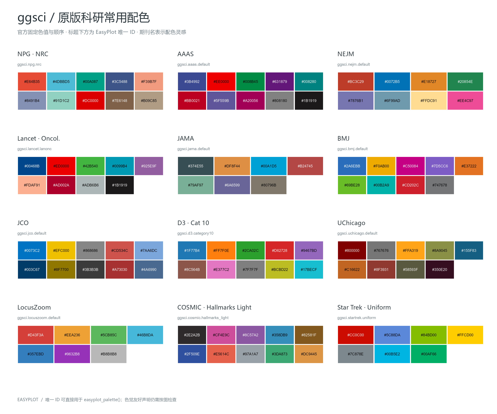
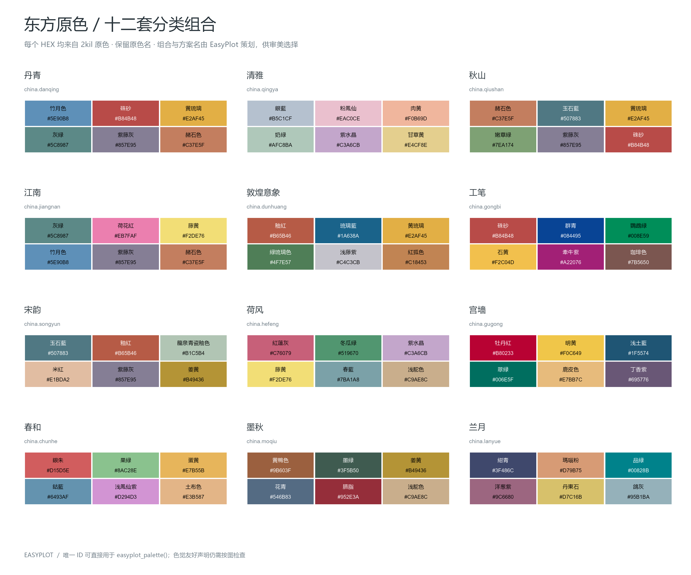
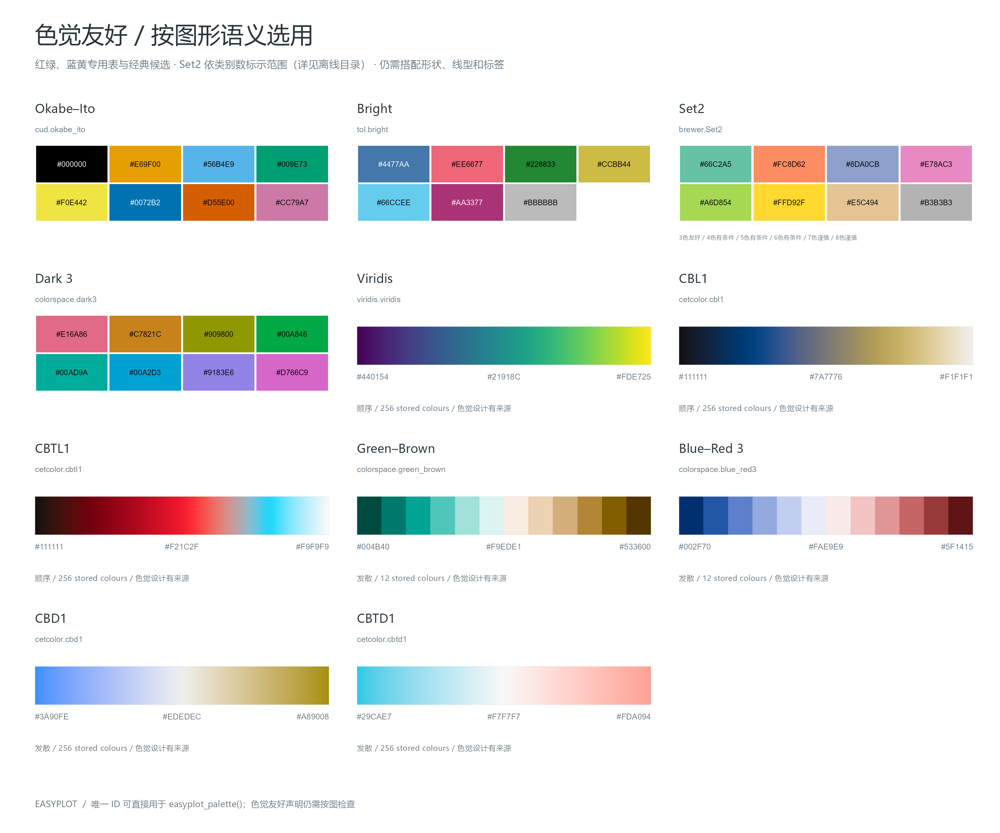

<p align="center">
  
</p>

<p align="center">
  
  
  
</p>

# EasyPlot

EasyPlot 是面向科研数据分析与作图的 AI Agent Skill。它把数据准备、统计分析、图形设计、组合排版和出版前检查放在一个入口中；默认使用 R/ggplot2，用户明确要求 Python 时使用 Python 科学绘图库，并保留现有项目的分析约定。

## 能做什么

- **分析与数据准备**：围绕研究问题检查实验单位、变量、缺失值、重复结构和不确定性；已有结果作图时保留原有分析，不为作图擅自重算。
- **常见科研图形**：条形图、分布图与原始散点、时间序列、散点/回归、热图，以及可复用的多面板组合。
- **组合图与地图**：对齐可比较的绘图区；按地图用途声明底图来源、投影、范围和比例。中国地图工作流支持 `ggmapcn`，全球图区分 Robinson 等折衷投影与 Equal Earth 等积投影。
- **有名字、可复用的色带**：包括 ggsci、ColorBrewer、viridis、CET、HCL、Okabe–Ito、Paul Tol、Scientific Colour Maps、cmocean，以及中国/东方色系。精确色带 ID 和组别顺序可写进脚本，在组合图中保持一致。
- **期刊与导出检查**：显式处理图幅尺寸、字体、格式、分辨率和最终尺寸预览；提供元数据、对比度和灰度筛查及导出 provenance 工具。自动检查是预检，不能替代科学判断或期刊官方要求。

## 色带目录

离线目录收录 **335 个核心色带记录**，另有 **1,202 个 ggsci iTerm 扩展方案**。目录可以按类别、数据类型和色觉证据筛选，并复制唯一 ID 或代码调用。色盲友好候选会根据离散/连续/发散数据类型和类别数量选择；灰度与色觉模拟用于发现风险，不会自动给散点加形状或给曲线加线型。

`china.*` 是 EasyPlot 按方案组合的 2kil 东方色原色，保留来源色名；`dongfang.*` 是早期经典色带衍生候选。两者来源不同，目录中分别标注。

<details>
<summary>预览：经典科研、中国/东方与色盲友好配色</summary>

<table>
  <tr>
    <th>ggsci 与期刊经典色带</th>
    <th>中国/东方原色色带</th>
    <th>色盲友好候选</th>
  </tr>
  <tr>
    <td></td>
    <td></td>
    <td></td>
  </tr>
</table>

[打开可搜索的离线色带目录](assets/palette-gallery/index.html) · [色带规则与来源说明](references/palette-library.md)
</details>

新图没有指定色带、项目也没有既定配色时，EasyPlot 会先询问偏好：自动匹配、柔和期刊风、经典科研、色盲友好、中国/东方色，或指定色带 ID/HEX。用户已有明确选择时直接沿用；相关图组只询问一次并保持颜色映射稳定。

## 快速使用

在支持 Agent Skills 的 AI Agent 中直接描述任务；如果运行环境支持 `$skill` 显式调用，也可以使用 `$easyplot`。提供数据/已有分析结果、研究问题、目标图形和输出格式；如需 Python、指定期刊或色带，可一并说明。

```text
$easyplot
请用 Python 将这份已有汇总结果画成带置信区间的分组图，组别顺序沿用数据，使用 ggsci.npg.nrc，导出 PNG 和 PDF。
```

也可以从分析开始：

```text
$easyplot
请先检查这份实验数据的重复结构和缺失情况，再按实验单位分析 treatment 对 response 的影响；报告效应量和区间，并给我可复现的 R 脚本和图。
```

## 默认作图约定

- 图号、图题、图注和统计方法说明默认放在图外；图内保留必要的坐标轴、单位、分面标记和直接标注。
- 组间区分优先使用稳定的颜色映射；色觉/灰度筛查只报告问题，不会自动堆叠形状和线型。
- 不虚构观测、样本量、误差线、显著性或统计结果；不确定性定义和数据处理写进脚本或说明。
- 最终按实际使用尺寸检查标签、图例、裁切和面板对齐；期刊尺寸与字体按具体期刊官方要求核实。

## 技能文件

- [`SKILL.md`](SKILL.md)：主入口与默认规则。
- [`references/templates.md`](references/templates.md)：图形模板与多面板组合约定。
- [`references/palette-library.md`](references/palette-library.md)：色带 ID、选择依据和来源。
- [`references/global-maps.md`](references/global-maps.md)：全球地图投影与制图约定。
- [`assets/palette-gallery/index.html`](assets/palette-gallery/index.html)：可搜索的离线色带预览。

## 许可

EasyPlot 自有脚本、技能说明、文档和原创色带方案采用 MIT License，见 [`LICENSE`](LICENSE)。第三方色带数据与源码保留各自的上游许可和署名要求，详见 [`assets/palette-licenses/NOTICES.md`](assets/palette-licenses/NOTICES.md) 及相邻许可文件；仓库根目录的 MIT 许可不会覆盖这些第三方材料。东方传统色名与 HEX 色值按公版事实数据整理，并保留 2kil 来源标注；不包含其网站版式或页面设计。
