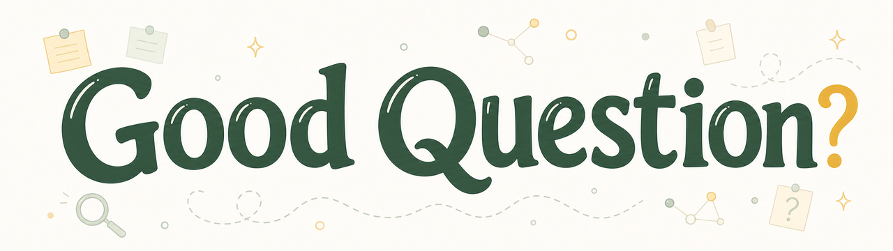

# Good Question

<picture>
  <source srcset="assets/good-question-integrated-banner-1280.webp" type="image/webp">
  
</picture>

<p align="center">
  
  
  
</p>

<p align="center">
  <a href="#zh-cn">中文</a> | <a href="#english">English</a>
</p>

<a id="zh-cn"></a>

## 中文

`good-question` 是一个帮助研究者梳理和打磨科研问题的 agent skill。

它适合这样的时刻：你有一个方向、一个文献空白、一个 proposal 摘要，或者一堆看起来都能做的想法，但还不确定哪个问题真正值得投入。它不会只给你一串灵感，而是帮你把想法整理成更可靠的研究问题：为什么重要，怎样用证据检验，可能有哪些解释，什么结果会推翻它，下一步该做什么。

### 你可以用它做什么

| 你的状态 | 它会帮你做什么 |
|---|---|
| 只有一个模糊兴趣 | 把兴趣拆成可比较的候选问题 |
| 找到了文献空白 | 判断这个空白是否真的有理论或实践价值 |
| 已经有一个想法 | 检查重要性、可行性、可证伪性和两周内可做的初步验证 |
| 想做机制解释 | 拆出竞争性假设和关键判别实验 |
| 准备 proposal 或基金 | 模拟评审会攻击哪里，并给出修补方式 |
| 方向依赖近期进展 | 先整理公开来源的领域简报，再定制问题 |
| 项目卡住了 | 用边界条件、失败信号和条件变化重新定位问题 |

### 它会输出什么

通常会得到一张或几张“好问题卡”。中文用户默认会得到类似这样的本地化卡片：

```markdown
**暂定题目：** ...
**核心研究问题：** ...
**为什么值得做：** ...
**它挑战了什么默认假设：** ...
**竞争性解释：** ...
**关键判别证据或实验：** ...
**什么结果会推翻它：** ...
**两周内可做的初步验证：** ...
**最强评审质疑：** ...
**下一步动作：** ...
```

重点不是把话说漂亮，而是让你能判断：这个问题值不值得继续推进。

### 安装

Codex:

```bash
git clone https://github.com/Rimagination/good-question.git ~/.codex/skills/good-question
```

Claude Code:

```bash
git clone https://github.com/Rimagination/good-question.git ~/.claude/skills/good-question
```

其他 agent 也可以使用：把 `SKILL.md` 当作主流程，把 `references/` 当作按需加载的方法卡即可。

### 快速开始

最简单的用法：

```text
用 $good-question 帮我把这个粗略想法打磨成一个好的科研问题：
[你的想法]
```

如果你愿意提供更多上下文，效果会更好：

```text
领域：
当前想法或困惑：
已有数据 / 方法 / 资源：
时间限制：
目标：论文 / 开题 / 基金 / 初步验证 / rebuttal
我最担心的问题：
```

更多常用入口：

```text
用 $good-question 压力测试这个 proposal，重点找评审最可能攻击的地方：
[proposal 摘要]
```

```text
用 $good-question 把这个文献空白改写成更有理论贡献的问题：
[空白描述]
```

```text
用 $good-question 先做一个基于公开来源的领域简报，再帮我形成候选问题：
[领域或方向]
```

```text
用 $good-question 先做来源核查，检查这些文献是否真的支持我的文献空白和贡献声明：
[你的文献空白 / 关键声明 / 文献列表]
```

### 不同领域怎么用

如果你来自生态、遥感、AI4Science、社会科学、生物医学、人文解释型研究或工程系统，先看 [`docs/field-playbooks.md`](docs/field-playbooks.md)。

它不是给 agent 的方法卡，而是给研究者的使用指南：每个领域应该提供什么上下文、常见弱问题是什么、好问题通常长什么样、评审最容易攻击哪里，以及该选择导师/评审/合作者/基金哪种模式。

### 它如何工作

`good-question` 的流程很简单，但会比较严格：

1. 先判断你现在处在什么状态：模糊兴趣、文献空白、已有想法、proposal，还是卡住的项目。
2. 根据语境切换导师、评审、合作者或基金模式。
3. 如果需要领域定制，就先整理简明的领域简报，区分来源证据、推断和未知。
4. 对生态、遥感、AI4Science、社会科学、生物医学等场景，按需加载轻量领域适配器。
5. 如果用户要求第一性原理或规则冲突判断，就把第一性原理当作校准工具：检查问题价值、关键假设、竞争解释、可推翻条件和证据边界，但不绕过来源核查、领域证据或竞争性假设。
6. 用结构化视角生成候选问题，但不把候选问题直接当成答案。
7. 用重要性、可行性、可证伪性、证据杠杆和负结果价值来收敛。
8. 把“主题、方法、文献空白”这类比较弱的表述改写成真正的问题。
9. 做最后的评审式压力测试：如果评审会拒，先修到能站住。

### 什么是好问题

在这个项目里，一个 good question 至少要通过七个检查：

1. **有意义。** 回答它会改变理论、方法、实践、政策或下一步研究。
2. **够具体。** 它不是一个宽泛主题，而是一个可被证据触及的问题。
3. **有竞争解释。** 至少存在两个或三个可能解释，而不是只有一个偏爱的假设。
4. **可以被推翻。** 有结果会削弱、修正或杀死它。
5. **现实中能启动。** 研究者能在现实约束下启动一个可信的初步验证。
6. **负结果也有价值。** 即使主要假设不成立，也能产生有价值的边界、机制或方法信息。
7. **需要时有依据。** 如果问题依赖当前领域状态，它必须能追溯到公开来源，或明确标注为推断。

### 第一性原理如何辅助项目

第一性原理在 `good-question` 里不是一套新的总规则，而是帮助用户把研究问题拆回最基本的判断：为什么值得做，哪些是假设，哪些有证据，什么结果会推翻它，下一步最小测试是什么。

它主要辅助三件事：

- **避免问题过大：** 把宏大的方向收束成可以用证据检验的具体问题。
- **看清隐藏假设：** 区分真正的约束、可争辩的假设和已经有来源支持的判断。
- **保留不同解释：** 要求保留竞争性解释和可能失败的测试，而不是只给出一个看似顺畅的答案。

这和项目现有体系并不冲突：科学哲学文献指出，不同学科中的第一性原理地位并不完全相同 [11][12]，原则推理也需要保留可错性和经验校验 [13]；因此它会配合强推理、问题化和来源核查使用，而不是替代它们 [4][5][14]。

### 方法来源

这个 skill 不是凭空写出来的一套提示词。它把一些可靠来源中的科研思维动作沉淀成可复用流程：

| 来源线索 | 这个项目吸收了什么 |
|---|---|
| Alon, Fischbach, Stanford Engineering [1][2][3] | 选问题是一种可训练能力，要比较问题、识别陷阱，不要方法先行 |
| Platt [4] | 好问题应该能产生竞争性假设和判别实验 |
| Alvesson & Sandberg [5] | 不要只找文献空白，要挑战文献背后的默认假设 |
| Heilmeier Catechism [6] | proposal 必须说清楚目标、受众、风险、成功标准和失败标准 |
| Hamming, Nielsen [7][8] | 科研品味来自长期维护重要问题清单和可攻击机会 |
| Peters [9] | 好问题常常来自对文献、不确定性和约束的反复重写 |
| Orchestra Research [10] | 用结构化视角发散，再用严格标准收束 |
| First-principles literature [11][12][13][14] | 第一性原理适合作为校准工具，用来暴露基本约束和假设边界，但不能替代证据、领域规范或竞争性假设 |

### 能力边界

`good-question` 可以帮你把研究问题整理得更清楚、更可检验，但它不是全知百科，不会替你编造领域共识。需要当前领域信息或本地知识不足时，它应该显式进入增强检索，先基于公开来源形成简报，再明确哪些判断来自证据，哪些只是推断。
它不会把“我没查到”写成“没人做过”，也不会在没有来源时声称某个文献空白、共识或最新趋势已经成立。

它也不会把每个想法都包装成“可做”。如果一个问题只有 novelty、没有受众、无法证伪，或者负结果学不到东西，它会建议重写、搁置或放弃。

<p align="right"><a href="#good-question">回到顶部</a> | <a href="#english">English</a></p>

<a id="english"></a>

## English

`good-question` is a portable agent skill for sharpening research questions.

Use it when you have a direction, a literature gap, a proposal sketch, or several possible ideas, but you are not sure which question is worth real work. It does not simply list ideas. It helps turn a rough direction into a question with stakes, rivals, falsifiers, a feasible pilot, and a clear next move.

### What It Helps With

| Your situation | What it helps you do |
|---|---|
| Broad interest | Turn it into comparable candidate questions |
| Literature gap | Decide whether the gap has real theoretical or practical value |
| Early idea | Test importance, feasibility, falsifiability, and a two-week pilot |
| Mechanism question | Build rival hypotheses and discriminating tests |
| Proposal or grant | Find reviewer objections and repair the weak points |
| Field depends on recent work | Build a public-source domain brief before question generation |
| Stalled project | Reframe through boundaries, failure signals, and changed conditions |

### What You Get

The usual output is one or more `Good Question Card`s:

```markdown
**Working title:** ...
**Research question:** ...
**Why it matters:** ...
**Core assumption challenged:** ...
**Competing hypotheses:** ...
**Discriminating observation or experiment:** ...
**What would falsify it:** ...
**Two-week pilot:** ...
**Strongest reviewer objection:** ...
**Best next action:** ...
```

The goal is not prettier wording. The goal is a better decision about whether the question deserves your time.

### Installation

Codex:

```bash
git clone https://github.com/Rimagination/good-question.git ~/.codex/skills/good-question
```

Claude Code:

```bash
git clone https://github.com/Rimagination/good-question.git ~/.claude/skills/good-question
```

Other agents can use `SKILL.md` as the main workflow and `references/` as on-demand method cards.

### Quick Start

Basic use:

```text
Use $good-question to sharpen this rough idea into a strong research question:
[your idea]
```

Better input:

```text
Field:
Current idea or confusion:
Available data / methods / resources:
Time constraint:
Target: paper / thesis proposal / grant / pilot / rebuttal
My biggest concern:
```

Other useful prompts:

```text
Use $good-question to stress-test this proposal and identify the objections reviewers are most likely to raise:
[proposal summary]
```

```text
Use $good-question to turn this literature gap into a question with stronger theoretical contribution:
[gap description]
```

```text
Use $good-question to first build a public-source domain brief, then generate candidate questions:
[field or direction]
```

```text
Use $good-question to run a Source Audit before accepting this literature gap and contribution claim:
[your gap / key claims / source list]
```

### Field Playbooks

If you work in ecology, remote sensing, AI4Science, social science, biomedicine, humanities, or engineering systems, start with [`docs/field-playbooks.md`](docs/field-playbooks.md).

It is a human-facing guide, not an agent method card. It shows what context to provide, common weak questions in each field, what stronger questions usually look like, likely reviewer objections, and which mode to choose.

### How It Works

The workflow is simple, but strict:

1. Diagnose the starting point: broad interest, gap, idea, proposal, or stalled project.
2. Infer the working mode: mentor, reviewer, collaborator, or grant.
3. If field context matters, build a compact domain brief and label claims as source-backed, inference, or unknown.
4. Load a lightweight domain adapter when ecology, remote sensing, AI4Science, social science, or biomedicine evidence norms matter.
5. If the user asks for first principles or rule conflicts, use first principles as a calibration layer: check stakes, assumptions, rivals, falsifiers, and evidence boundaries without bypassing source audit, field evidence, or competing hypotheses.
6. Generate candidates with structured lenses, but do not treat raw ideas as answers.
7. Converge using importance, feasibility, falsifiability, evidence leverage, and downside learning.
8. Rewrite weak forms such as topics, methods, benchmarks, and gaps into actual questions.
9. Run an editor-desk reject gate before recommending finalists.

### What Counts As A Good Question

In this project, a good question should pass at least seven checks:

1. **It matters.** Answering it changes theory, method, practice, policy, or the next research step.
2. **It is specific.** It is not just a broad topic; evidence can touch it.
3. **It has rivals.** At least two plausible explanations could compete.
4. **It can fail.** Some result could weaken, revise, or kill the idea.
5. **It is feasible enough.** A credible pilot can start under real constraints.
6. **It teaches even when negative.** Failure still clarifies a boundary, mechanism, or method.
7. **It is grounded when context matters.** If the question depends on the current state of a field, it traces back to public sources or is clearly labeled as inference.

### How First Principles Helps The Project

In `good-question`, first-principles thinking is not a new master rule. It helps users reduce a research idea to the basic judgments that matter: why it is worth doing, which claims are assumptions, which claims have evidence, what would overturn the idea, and what the smallest useful next test would be.

It helps the project in three practical ways:

- **Keeps questions lean:** turns broad directions into specific questions evidence can touch.
- **Exposes hidden assumptions:** separates real constraints, contestable assumptions, and source-backed claims.
- **Preserves alternatives:** keeps rival explanations and falsifying tests in view instead of producing one elegant answer.

This fits the existing system: first principles vary across scientific fields [11][12], and principle-based reasoning still needs fallibilism and empirical checks [13]. So this project uses first principles alongside strong inference, problematization, and source audit, not as a replacement for them [4][5][14].

### Method Sources

This is not just a prompt bundle. It turns research-method advice from reliable sources into reusable agent workflow:

| Source line | What this project uses |
|---|---|
| Alon, Fischbach, Stanford Engineering [1][2][3] | Problem choice is trainable: compare questions, surface traps, and avoid method-first projects |
| Platt [4] | Strong questions create rival hypotheses and discriminating tests |
| Alvesson & Sandberg [5] | Move beyond gap-spotting by challenging assumptions |
| Heilmeier Catechism [6] | Proposals need clear goals, audience, risks, success criteria, and failure criteria |
| Hamming, Nielsen [7][8] | Research taste comes from important-problems lists and attackable openings |
| Peters [9] | Good questions often emerge through iterative rewriting of literature, uncertainty, and constraints |
| Orchestra Research [10] | Diverge with structured lenses, then converge with strict standards |
| First-principles literature [11][12][13][14] | First principles work best as a calibration layer for constraints and assumptions, not as a replacement for evidence, field norms, or rival hypotheses |

### Limits

`good-question` can make a question sharper, but it is not an omniscient encyclopedia and should not invent field consensus. When current field context matters or local knowledge is insufficient, it should explicitly enter enhanced retrieval, build a public-source brief first, and label what is evidence versus inference.
It should not turn "I did not find work on X" into "nobody has studied X", and it should not assert a literature gap, consensus, or latest trend without sources.

It also should not make every idea look viable. If a candidate is only novel, has no audience, cannot fail, or teaches nothing when negative, it should be rewritten, parked, or discarded.

<p align="right"><a href="#good-question">Back to top</a> | <a href="#zh-cn">中文</a></p>

## References / 参考文献

The references below are cited as methodological sources for the skill, not as decoration.

1. Alon, U. (2009). How to choose a good scientific problem. *Molecular Cell, 35*(6), 726-728. https://doi.org/10.1016/j.molcel.2009.09.013
2. Fischbach, M. A. (2024). Problem choice and decision trees in science and engineering. *Cell, 187*(10), 2363-2367. https://doi.org/10.1016/j.cell.2024.03.012
3. Stanford Engineering. (2024, October 23). How to pick and solve the next great problem. https://engineering.stanford.edu/news/how-pick-and-solve-next-great-problem
4. Platt, J. R. (1964). Strong inference. *Science, 146*(3642), 347-353. https://doi.org/10.1126/science.146.3642.347
5. Alvesson, M., & Sandberg, J. (2011). Generating research questions through problematization. *Academy of Management Review, 36*(2), 247-271. https://doi.org/10.5465/amr.2009.0188
6. DARPA. (n.d.). The Heilmeier Catechism. Retrieved June 1, 2026, from https://www.darpa.mil/about/heilmeier-catechism
7. Hamming, R. W. (1986). You and your research. Bell Communications Research colloquium. https://www.cs.virginia.edu/~robins/YouAndYourResearch.html
8. Nielsen, M. (2004). Principles of effective research. https://michaelnielsen.org/blog/principles-of-effective-research/
9. Peters, M. A. K. (2025). How to develop good research questions. *Nature Human Behaviour*. https://doi.org/10.1038/s41562-025-02292-5
10. Orchestra Research. (n.d.). Research Idea Brainstorming. *AI-Research-SKILLs*. Retrieved June 1, 2026, from https://github.com/Orchestra-Research/AI-Research-SKILLs/blob/main/21-research-ideation/brainstorming-research-ideas/SKILL.md
11. Herfeld, C., & Ivanova, M. (2021). Introduction: first principles in science-their status and justification. *Synthese, 198*, 3297-3308. https://doi.org/10.1007/s11229-020-02801-1
12. Hendry, R. F. (2021). Elements and (first) principles in chemistry. *Synthese, 198*, 3391-3411. https://doi.org/10.1007/s11229-019-02312-8
13. Hoover, K. D. (2021). First principles, fallibilism, and economics. *Synthese, 198*, 3309-3327. https://doi.org/10.1007/s11229-018-02021-8
14. Tan, J., & Xiao, X. (2025). Harness first-principles thinking in problem-based learning for chemical education. *Journal of Chemical Education, 102*(2), 943-947. https://doi.org/10.1021/acs.jchemed.4c01178
