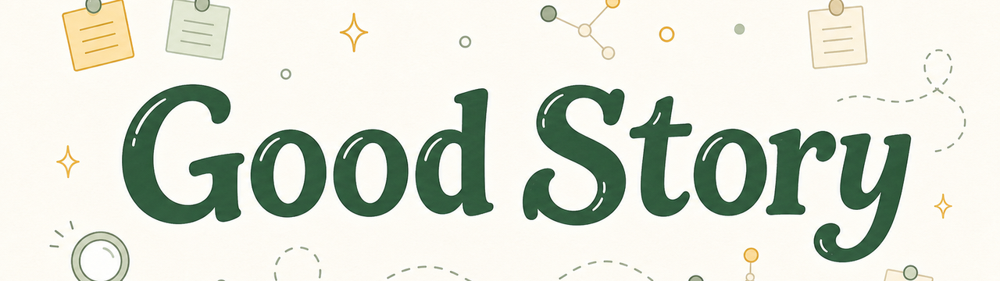

# Good Story

<picture>
  <source srcset="assets/good-story-integrated-banner-1280.webp" type="image/webp">
  
</picture>

<p align="center">
  
  
  
</p>

<p align="center">
  <a href="#zh-cn">中文</a> | <a href="#english">English</a> | <a href="#references--参考文献">References</a>
</p>

<a id="zh-cn"></a>

## 中文

`good-story` 是一个给科研写作用的 agent skill。它帮你把手里的结果、图表和草稿，整理成一个证据站得住、读者听得懂、审稿人也挑不散的论文故事。

它最适合这样的时刻：你已经有实验结果、图表、模型、材料、访谈、遥感产品、基准测试结果或论文草稿，但还说不清“这篇文章到底改变了什么”。它不只是把句子润得更顺，而是帮你判断：主线该押在哪里，证据够不够，哪句话说过头，图的顺序能不能带着读者往前走，审稿人最可能卡在哪里。

一句话说：**它把“我有一堆结果”，变成“我有一个站得住、讲得清、别人记得住的科学故事”。**

它不会把弱证据包装成强结论。它做的是把最诚实、最有证据支撑的故事变得更容易被看见、被评估、被记住。

### 为什么讲故事重要

科研写作不是把实验日志按时间顺序抄一遍。论文要面对的是注意力有限、标准很高、还带着质疑来读的真实读者：编辑要先看见这篇文章为什么值得进入审稿，审稿人要能沿着证据链检查每个判断，领域读者要能带走一个清楚的新认识。

这也是为什么很多科学写作资料反复强调“故事”：Mensh & Kording 把论文结构收束到一个中心贡献，Sanes 直接说科学论文需要讲故事，Nature Masterclasses 也把主线和关键结论列为研究者写作中的核心挑战。[2][5][24][25] 但这里的故事不是编剧情。Nature Methods 对科学叙事的提醒很重要：故事可以帮助理解，也可能在追求“完美叙事”时诱导挑选证据、遮住失败实验或不确定性。[16] 所以 `good-story` 的底线是：故事必须服务证据，而不是替证据表演。

### 先看这里

| 你现在想做什么 | 直接去这里 |
|---|---|
| 先理解为什么要讲故事 | [为什么讲故事重要](#为什么讲故事重要) |
| 先判断它适不适合你 | [什么时候用它](#什么时候用它) |
| 直接复制提示词开跑 | [复制这些提示词](#复制这些提示词) |
| 看它到底怎么改 | [看几个真实例子](#看几个真实例子) |
| 处理跨领域材料 | [不同领域怎么用](#不同领域怎么用) |
| 找更完整的模板 | [templates/README.md](templates/README.md) |
| 看输出应该长什么样 | [docs/OUTPUT_SPEC.md](docs/OUTPUT_SPEC.md) |
| 发布或扩展这个产品 | [RELEASE.md](RELEASE.md) / [CONTRIBUTING.md](CONTRIBUTING.md) |

### 什么时候用它

| 你的状态 | 可以让它做什么 |
|---|---|
| 结果很多但主线散 | 找到最值得押注的主线，并给出几个备选讲法 |
| 稿子像实验记录 | 重排引言、结果、讨论和图的顺序 |
| 摘要或标题不够有力 | 梳理背景、缺口、关键证据、中心结论和意义 |
| 图表很多但读者不跟 | 把图表排成一层层递进的证据链 |
| 想投更强的期刊 | 检查故事张力、关键转折、目标读者和审稿风险 |
| 担心包装过头 | 检查因果、机制、普遍性、临床意义或政策意义有没有说过头 |
| 准备投稿信或回复审稿意见 | 模拟审稿人会攻击哪里，并给出修补路径 |
| 换到新领域写作 | 先弄清这个领域看重什么证据、结论能说到多强 |

### 你会得到什么

通常会得到一张“故事卡”：

```markdown
**最强故事：** ...
**为什么这个故事成立：** ...
**故事主线：** ...
**证据地图：** ...
**薄弱点：** ...
**重写目标：** ...
```

如果涉及跨领域写作，它还会先帮你说清楚：

```markdown
**领域校准：** ...
**你手里的材料属于哪类证据：** ...
**这个领域认什么证据：** ...
**结论可以说到什么强度：** ...
**主要审稿风险：** ...
```

### 看几个真实例子

如果你想先看它到底会怎么改，可以直接看：

- [Before / After 样例](examples/before-after.md)：摘要、图的顺序、零散结果和说过头的讨论，分别怎么改。
- [跨领域迷你案例](examples/field-mini-cases.md)：生态、遥感、AI4Science、社会科学、生物医学各怎么校准证据。
- [样例入口](examples/README.md)：不知道从哪看起时，从这里开始。

### 复制这些提示词

最省事的问法：

```text
用 $good-story 帮我从这些材料里找出最有力、也最站得住的论文故事：
[粘贴结果、图表、摘要或草稿]
```

信息多一点时，可以这样问：

```text
研究领域：
目标期刊或目标读者：
已有结果 / 图表 / 材料：
我想表达的中心结论：
我最担心被质疑的地方：
负结果或限制：
想改的部分：摘要 / 引言 / 结果顺序 / 讨论 / 投稿信 / 回复审稿意见
```

常用任务：

```text
用 $good-story 帮我重排这组图，让每张图都为一个结论服务：
[figure list]
```

```text
用 $good-story 检查这个摘要有没有说过头，必要时重写：
[abstract]
```

```text
用 $good-story 把这些零散结果整理成 3 种可能的论文主线，并排序：
[results]
```

```text
用 $good-story 先帮我做领域校准，再告诉我这个遥感 / AI4Science / 社会科学 / 生物医学结果适合怎么讲：
[材料]
```

更多复制即用模板见 [templates/README.md](templates/README.md)，包括故事诊断、摘要重写、图的顺序、领域校准和回复审稿意见。

### 它和普通润色有什么不同

普通润色多半是在句子层面做加法。`good-story` 会先问一个更前面的问题：这个故事本身能不能站住？

你在使用时会明显感觉到几件事：

1. **先找张力，再改句子。** 好故事不是“这个主题很重要”，而是“领域里原来相信什么、哪里卡住了、你的证据让读者现在能相信什么”。这个思路来自科学叙事和论文结构方法。[1][2][5]
2. **先排证据，再排章节。** 它会问每张图到底推动了哪个判断，而不是简单按实验时间线堆结果。[2][4]
3. **结论不能比证据跑得更快。** 它会检查相关性有没有被写成因果，局部样本有没有被写成普遍规律，临床前结果有没有被写成临床获益。[9][16][17][18][19]
4. **换领域时，先换证据标准。** 生态、遥感、AI4Science、社会科学、生物医学等领域的证据标准不同；同一套故事框架可以共用，但结论能说多强、审稿人会先挑什么，必须按领域来。
5. **既学经典问题，也学现代写法。** 经典论文常教“问题为什么有力量”，近年论文常教“如何让忙碌读者迅速看懂”。两者都需要。[20][21][22][23]

它还会检查“受众契约”：编辑需要看见意义和时机，审稿人需要检查证据、逻辑和限定条件，领域读者需要记住这篇文章到底让他们以后能怎样想、怎样测量、怎样判断。好的论文故事要同时服务这三类读者，不能为了更戏剧化而藏起不确定性。[2][5][24][25]

### 不同领域怎么用

`good-story` 不是生态学专用，也不只支持下面几个领域。下面这张表只是提醒你：不同领域在讲故事之前，要先弄清的东西不一样。

| 领域 | 先弄清什么 |
|---|---|
| 生态 | 尺度、样地、物种、相互作用、扰动背景，避免把局部系统写成普遍生态定律 |
| 遥感 | 产品精度、地面验证、误差传播和地表过程意义，避免把分类结果直接写成因果解释 |
| AI4Science | 训练数据是否泄漏、能否泛化到分布外、是否满足物理约束、有没有实验或模拟验证，避免把基准测试提升直接写成科学发现 |
| 社会科学 | 概念或构念、样本、识别策略、语境和竞争解释，避免没有识别设计就使用强因果说法 |
| 生物医学 | 机制证据、临床前证据、临床关联、替代终点、真实患者获益和安全性，避免从相关性或动物模型跳到临床疗效 |
| 其他领域 | 你手里的材料是什么证据、这个领域信什么证据、结论能说多强、读者关心什么、审稿人会先挑什么 |

### 它实际会怎么做

1. 先把材料摊开：结果、图表、方法、对照、负结果、限制和目标读者。
2. 找几种可能的主线：主角是什么，障碍是什么，哪个结果改变了读者能相信的东西。
3. 选最强但不越界的故事，而不是最戏剧化的故事。
4. 调整证据顺序，让每个结果都推进中心结论。
5. 检查结论、证据、理由、限定条件和可能反驳。
6. 给出具体修改动作：标题、摘要、章节顺序、图的顺序或关键段落。

### 什么是好故事

一个好科研故事至少要通过这些检查：

1. **真实。** 故事不能跑到证据前面。
2. **有张力。** 它解决真实缺口、矛盾、瓶颈或未知，而不只是说 "little is known"。
3. **有转折。** 至少有一个结果改变读者原来的判断。
4. **有证据阶梯。** 每个结果都让中心主张更可信。
5. **有边界。** 主张范围和证据范围一致。
6. **能被记住。** 读者能用一句话带走它。
7. **经得起审稿。** 它正面处理限制、替代解释和负结果。

### 安装

Codex:

```bash
git clone https://github.com/Rimagination/good-story.git ~/.codex/skills/good-story
```

Claude Code:

```bash
git clone https://github.com/Rimagination/good-story.git ~/.claude/skills/good-story
```

其他 agent 也可以使用：把 `SKILL.md` 当作主流程，把 `references/` 当作按需加载的方法卡。

### 方法来源

这套方法不是凭空写出来的一组提示词。它把可靠来源中的科学写作动作整理成可复用流程：

| 来源线索 | 这个项目吸收了什么 |
|---|---|
| Schimel [1] | OCAR 叙事结构；科学写作需要故事 |
| Mensh & Kording [2] | 一个中心贡献，递归结构，结果要围绕主张来安排 |
| Gopen & Swan [3] | 读者期待、先旧后新、把重点放在有力位置 |
| Whitesides [4] | 先用提纲和图搭论文，而不是按实验时间线写 |
| Sanes [5] | 科学论文受真相约束，但仍需要主动构造故事 |
| Heard / Cargill & O'Connor [11][12] | 写作是可训练的修订实践，Results 是把数据变成知识的关键位置 |
| Swales / CARS [6] | 引言要交代研究场域、缺口和本文贡献 |
| Olson / ABT [7] | 用 And、But、Therefore 压缩叙事张力 |
| Graff & Birkenstein [13] | 新主张要回应已有学术对话，而不是孤立地宣布“新” |
| Montagnes et al. / Waterloo [14][15] | 从结论和叙事弧反推论文结构 |
| Toulmin / Craft of Research [8][9] | 主张、证据、理由、限定和反驳 |
| Heilmeier Catechism [10] | proposal 要说清楚目标、受众、风险和成功标准 |
| EQUATOR / anti-spin / avoid hype [17][18][19] | 透明报告、限制、负结果和不过度解释是底线 |
| High-impact paper patterns [20][21][22][23] | 从经典和高影响论文学习可复用的故事结构 |
| Nature Masterclasses [24][25] | 主线、关键结论、受众目的，以及为什么在拥挤文献中让人理解和记住很重要 |
| Nature Methods [16] | 叙事可以帮助理解科学，但不能成为挑选证据、隐藏失败实验或回避不确定性的理由 |

### 质量保障

`evals/` 是评测集目录，里面放了一组回归场景，用来检查这个技能是否真的能稳定处理不同任务，而不是只在 README 里看起来好用：

- [评测说明](evals/README.md)：怎么跑场景、怎么判断通过或失败。
- [新鲜会话评测手册](evals/fresh-session-runbook.md)：怎么开 fresh sessions、怎么判分、怎么记录失败和修订。
- [评测场景](evals/scenarios.md)：摘要诊断、图的顺序、AI4Science、生物医学、社会科学、遥感中文输出、早期项目候选故事、rebuttal 准备和来源深度。
- [真实材料快速验收测试](evals/real-material-smoke-tests.md)：用基于全文阅读的转述材料检查生态、遥感、AI4Science、社会科学和生物医学真实公开来源。
- [当前评测基线](evals/baseline-2026-06-02.md)：记录 9 个场景的手工干跑结果和剩余风险。
- [新鲜会话实测记录](evals/fresh-session-run-2026-06-02.md)：记录 9 个评测场景和 6 个真实材料快速验收测试的 fresh-session 结果。
- [成熟度审计](evals/maturity-audit-2026-06-02.md)：说明当前 Mature 证据门槛和公开发布状态。
- [Mature 证据台账](evals/mature-evidence-2026-06-02.md)：记录 15 个以上案例计数和外部评审者证据。
- [公开外部反馈案例](evals/public-external-feedback-cases.md)：记录 3 份公开同行评审/作者回复证据。

当前状态：已公开发布，Mature 证据门槛已满足。静态产品校验通过，9 个评测场景和 6 个跨领域真实材料快速验收测试已在 fresh sessions 中通过；另有 3 个公开外部评审案例补足非作者评审者证据。直接用户试用反馈仍然值得继续收集。

可以运行这个静态检查脚本：[validate-product.ps1](scripts/validate-product.ps1)。

```powershell
.\scripts\validate-product.ps1
```

更严格的 Mature 证据门槛用 [validate-mature.ps1](scripts/validate-mature.ps1) 检查：

```powershell
.\scripts\validate-mature.ps1
```

### 发布前检查

如果要把它当成更成熟的产品发布，先看 [RELEASE.md](RELEASE.md)。里面列了发布前要检查的用户入口、技能行为、样例、评测、引用和静态检查，也给出了 Draft、Beta、Release candidate、Mature 的判断标准。

### 使用说明

- [FAQ](docs/FAQ.md)：回答“它是不是润色”“我是不是必须有完整稿子”“我的领域不在表里怎么办”等常见问题。
- [输出格式](docs/OUTPUT_SPEC.md)：说明故事卡、领域校准、候选故事、图序和 rebuttal 输出应长什么样。
- [路线图](docs/ROADMAP.md)：记录当前 Mature 证据门槛、公开发布状态和后续用户反馈计划。

### 参与扩展

如果要新增领域校准包、样例、评测场景或参考来源，请先看 [CONTRIBUTING.md](CONTRIBUTING.md)。版本变化记录在 [CHANGELOG.md](CHANGELOG.md)。

### 项目结构

```text
good-story/
  SKILL.md
  README.md
  RELEASE.md
  CONTRIBUTING.md
  CHANGELOG.md
  agents/
    openai.yaml
  assets/
    good-story-integrated-banner-1280.webp
    good-story-integrated-banner-1280.png
  examples/
    README.md
    before-after.md
    field-mini-cases.md
  evals/
    README.md
    fresh-session-runbook.md
    scenarios.md
    real-material-smoke-tests.md
    baseline-2026-06-02.md
    fresh-session-run-2026-06-02.md
    maturity-audit-2026-06-02.md
  templates/
    README.md
    story-diagnosis.md
    abstract-rewrite.md
    figure-order.md
    field-calibration.md
    rebuttal-prep.md
  docs/
    FAQ.md
    OUTPUT_SPEC.md
    ROADMAP.md
  scripts/
    validate-product.ps1
  references/
    story-principles.md
    story-learning-strategy.md
    terminology-style.md
    framework-governance.md
    overclaim-calibration.md
    cross-domain-transfer.md
    ecology-story-exemplars.md
    exemplar-paper-patterns.md
    source-map.md
```

`SKILL.md` 是主流程。`references/` 是按需加载的方法卡。更完整的来源映射在 `references/source-map.md`。

### 能力边界

`good-story` 可以帮你把论文故事变强，但不会替你编造领域共识、隐藏负结果、把相关性写成因果，或把狭窄证据包装成普遍结论。

它也不会把每个结果都包装成 "high impact"。如果最诚实的故事是边界条件、负结果、方法限制或更窄的机制，它会建议把故事收窄到能站住的地方。

最顺的故事不一定是最好的故事。如果负结果、失败尝试、关键限制或替代解释会改变读者对结论的判断，它们就应该进入故事边界，而不是被藏在叙事后面。

### 相关项目

- [Rimagination/good-question](https://github.com/Rimagination/good-question): 帮研究者把模糊方向打磨成值得投入的科研问题。`good-question` 处理“问题值不值得做”，`good-story` 处理“已有证据怎样讲成站得住的论文故事”。

<p align="right"><a href="#good-story">回到顶部</a> | <a href="#english">English</a></p>

<a id="english"></a>

## English

`good-story` is an agent skill that helps researchers turn existing evidence into a defensible paper story.

Use it when you already have results, figures, models, materials, interviews, remote-sensing products, benchmarks, or a draft, but cannot yet say what the paper changes. It does not merely polish sentences. It helps decide the strongest storyline, whether the evidence is enough, which claims overreach, whether the figure order carries the reader, and where reviewers are likely to push back.

In one sentence: **it turns "I have many results" into "I have a scientific story that is evidence-faithful and memorable."**

It does not make weak evidence look strong. It makes the strongest honest story easier to see, evaluate, remember, and review.

### Why Story Matters

Research writing is not a chronological lab log. A paper is read by people with limited attention, high standards, and legitimate skepticism: editors need to see why the work deserves review, reviewers need to inspect the evidence chain, and field readers need to leave with one clear new understanding.

That is why scientific-writing sources keep returning to story. Mensh & Kording center the paper around one contribution, Sanes argues that scientific articles benefit from story construction, and Nature Masterclasses treats storyline and key conclusions as a major writing challenge for researchers. [2][5][24][25] But story is not license to invent drama. Nature Methods gives the necessary caution: narrative can aid understanding, but the pursuit of a perfect story can encourage cherry-picking, obscured failed experiments, or hidden uncertainty. [16] The boundary condition for `good-story` is therefore simple: story must organize evidence, not perform in place of it.

### Start Here

| What you want | Go here |
|---|---|
| Understand why story matters | [Why Story Matters](#why-story-matters) |
| Decide whether this fits your task | [When To Use It](#when-to-use-it) |
| Copy a prompt and start | [Copy These Prompts](#copy-these-prompts) |
| See what it changes | [See Examples](#see-examples) |
| Work across fields | [Field Use](#field-use) |
| Use fuller templates | [templates/README.md](templates/README.md) |
| Check expected output shape | [docs/OUTPUT_SPEC.md](docs/OUTPUT_SPEC.md) |
| Release or extend the product | [RELEASE.md](RELEASE.md) / [CONTRIBUTING.md](CONTRIBUTING.md) |

### When To Use It

| Your situation | Use it to |
|---|---|
| Many results, no clear main line | Find the strongest central contribution and 2-4 candidate stories |
| Manuscript reads like lab chronology | Reorder Introduction, Results, Discussion, and figure order |
| Abstract or title feels weak | Compress context, gap, key evidence, claim, and implication |
| Figures do not carry the reader | Turn figures into an evidence ladder |
| Aiming for a stronger journal | Test tension, turn, audience, field consequence, and review risk |
| Worried about overclaiming | Check whether causal, mechanistic, general, clinical, or policy language is supported |
| Preparing submission, cover letter, or rebuttal | Surface likely reviewer objections and repair paths |
| Writing across fields | Calibrate the field's artifacts, evidence standards, and claim verbs first |

### What You Get

The usual output is a `Good Story Card`:

```markdown
**Best story:** ...
**Why this story works:** ...
**Story spine:** ...
**Evidence map:** ...
**Weak points:** ...
**Rewrite targets:** ...
```

When cross-domain transfer matters, it can also include:

```markdown
**Domain calibration:** ...
**Native artifact:** ...
**Local evidence standard:** ...
**Claim verb level:** ...
**Main review risk:** ...
```

### See Examples

If you want to see what the skill actually changes, start with:

- [Before / After examples](examples/before-after.md): abstract framing, figure order, scattered results, and overclaimed discussion.
- [Field mini cases](examples/field-mini-cases.md): ecology, remote sensing, AI4Science, social science, and biomedical calibration.
- [Examples index](examples/README.md): start here if you are not sure which example fits your task.

### Copy These Prompts

Shortest entry:

```text
Use $good-story to find the strongest scientific story in these results and explain why it works:
[paste results, figures, abstract, or draft]
```

More stable entry:

```text
Field:
Target journal or audience:
Available results / figures:
Claim I want to make:
Weakest point:
Negative results or limitations:
Target: abstract / introduction / results order / discussion / cover letter / rebuttal
```

Common tasks:

```text
Use $good-story to reorder this figure list so every figure advances a claim:
[figure list]
```

```text
Use $good-story to check this abstract for overclaiming and rewrite it if needed:
[abstract]
```

```text
Use $good-story to turn these scattered results into 3 ranked candidate stories:
[results]
```

```text
Use $good-story to do domain calibration first, then tell me how this remote sensing / AI4Science / social science / biomedical result should be framed:
[materials]
```

More copyable templates live in [templates/README.md](templates/README.md), including story diagnosis, abstract rewrite, figure order, field calibration, and rebuttal preparation.

### How It Differs From Polishing

Polishing makes sentences smoother. `good-story` first tests whether the story can stand.

1. **It finds tension before wording.** A good story moves from what the field believed or needed, to what was blocked, to what the evidence now lets readers believe. [1][2][5]
2. **It turns figures into an evidence ladder.** Each figure or analysis should make the next claim more believable, not merely report what happened next in the lab. [2][4]
3. **It calibrates claims to evidence.** It checks whether correlation, local evidence, preclinical findings, benchmarks, or narrow cases are being inflated. [9][16][17][18][19]
4. **It calibrates the domain before telling the story.** Ecology, remote sensing, AI4Science, social science, biomedicine, and other fields have different evidence standards and review risks.
5. **It learns from both classic problems and modern framing.** Classic papers often teach problem power; recent papers often teach how busy readers are guided. [20][21][22][23]

It also tests the audience contract. Editors need to see the stakes, reviewers need to inspect the logic, and field readers need to remember the contribution. A good story should serve all three without hiding uncertainty.

### Field Use

`good-story` is not ecology-only and not limited to the fields below. The table shows what different users should calibrate first.

| Field | Calibrate first |
|---|---|
| Ecology | Scale, site, organism, interaction, disturbance context, and limits on generality |
| Remote sensing | Pixels, products, retrieval algorithms, validation, error propagation, and earth-system meaning |
| AI4Science | Leakage, out-of-distribution generalization, physical constraints, ablations, and prospective validation |
| Social science | Constructs, sampling, identification, context, and rival explanations |
| Biomedical research | Mechanism, preclinical evidence, clinical association, surrogate endpoints, patient benefit, and safety |
| Other fields | Native artifact, evidence hierarchy, claim verb ladder, audience contract, and review risk |

### How It Works

1. Inventory the material: results, figures, methods, controls, negative results, limitations, and audience.
2. Generate candidate stories: protagonist, antagonist, turn, and resolution.
3. Choose the strongest honest story, not the most dramatic one.
4. Reorder evidence so every result advances the central claim.
5. Check claim, evidence, warrant, qualifier, and rebuttal.
6. Return concrete rewrite targets for title, abstract, section order, figure order, or key paragraphs.

### What Counts As A Good Story

A good research story should pass these checks:

1. **It is true.** It does not let story outrun evidence.
2. **It has tension.** It resolves a real gap, contradiction, bottleneck, or unknown.
3. **It has a turn.** At least one result changes what the reader can believe.
4. **It has an evidence ladder.** Each result makes the central claim more credible.
5. **It is calibrated.** The scope of the claim matches the scope of the evidence.
6. **It is memorable.** A reader can carry it away in one sentence.
7. **It survives review.** It handles limitations, rival explanations, and negative results.

### Installation

Codex:

```bash
git clone https://github.com/Rimagination/good-story.git ~/.codex/skills/good-story
```

Claude Code:

```bash
git clone https://github.com/Rimagination/good-story.git ~/.claude/skills/good-story
```

Other agents can use `SKILL.md` as the main workflow and `references/` as on-demand method cards.

### Method Sources

This is not just a prompt bundle. It turns scientific-writing advice from reliable sources into reusable agent workflow:

| Source line | What this project uses |
|---|---|
| Schimel [1] | OCAR story structure; science writing needs story |
| Mensh & Kording [2] | One central contribution, recursive structure, claim-driven results |
| Gopen & Swan [3] | Reader expectations, old-before-new, stress position |
| Whitesides [4] | Build the paper from outline and figures, not experiment chronology |
| Sanes [5] | Scientific articles are constrained by truth but benefit from story construction |
| Heard / Cargill & O'Connor [11][12] | Writing is a trainable revision practice; Results turn data into knowledge |
| Swales / CARS [6] | Introductions establish territory, niche, and contribution |
| Olson / ABT [7] | And, But, Therefore as compressed narrative tension |
| Graff & Birkenstein [13] | New claims should answer an existing scholarly conversation |
| Montagnes et al. / Waterloo [14][15] | Work backward from conclusions and use narrative arc to structure the paper |
| Toulmin / Craft of Research [8][9] | Claim, evidence, warrant, qualifier, rebuttal |
| Heilmeier Catechism [10] | Proposals need goals, audience, risks, and success criteria |
| EQUATOR / anti-spin / avoid hype [17][18][19] | Transparent reporting, limitations, negative results, and no over-interpretation |
| High-impact paper patterns [20][21][22][23] | Reusable story structures from classic and high-impact papers |
| Nature Masterclasses [24][25] | Storyline, key conclusions, audience purpose, and why memorable communication matters in a crowded literature |
| Nature Methods [16] | The caution that narrative can illuminate science but must not become an excuse for cherry-picking or hiding uncertainty |

### Quality Checks

`evals/` contains regression scenarios for checking whether the skill works reliably across tasks, not just whether the README sounds good:

- [Evaluation guide](evals/README.md): how to run scenarios and judge pass/fail.
- [Fresh-session runbook](evals/fresh-session-runbook.md): how to run fresh sessions, score answers, and record failures.
- [Evaluation scenarios](evals/scenarios.md): abstract diagnosis, figure order, AI4Science, biomedical overclaiming, social science, remote-sensing Chinese output, early candidate stories, rebuttal preparation, and source depth.
- [Real material smoke tests](evals/real-material-smoke-tests.md): six full-text-informed paraphrased public-material cases across ecology, remote sensing, AI4Science, social science, biomedical research, and earth system science.
- [Current baseline](evals/baseline-2026-06-02.md): manual dry-run results and remaining risks for the nine scenarios.
- [Fresh-session run record](evals/fresh-session-run-2026-06-02.md): recorded fresh-session results for the nine evaluation scenarios and six real-material smoke tests.
- [Maturity audit](evals/maturity-audit-2026-06-02.md): current Mature evidence gate and public-publication status.
- [Mature evidence ledger](evals/mature-evidence-2026-06-02.md): counted 15+ case evidence and external reviewer evidence.
- [Public external feedback cases](evals/public-external-feedback-cases.md): three public peer-review/author-response records.

Current status: publicly released, with the Mature evidence gate satisfied. Static product validation passes, nine evaluation scenarios plus six cross-domain real-material smoke tests passed in fresh sessions, and three public external reviewer records satisfy the non-author reviewer evidence threshold. Direct user-trial feedback remains worth collecting separately.

Run the static product checks with [validate-product.ps1](scripts/validate-product.ps1):

```powershell
.\scripts\validate-product.ps1
```

Check the stricter Mature evidence gate with [validate-mature.ps1](scripts/validate-mature.ps1):

```powershell
.\scripts\validate-mature.ps1
```

### Release Checklist

For product-level release checks, see [RELEASE.md](RELEASE.md). It covers user entry, skill behavior, examples, evaluations, references, static checks, and the distinction between Draft, Beta, Release candidate, and Mature.

### User Docs

- [FAQ](docs/FAQ.md): common questions about use, scope, languages, and failure modes.
- [Output spec](docs/OUTPUT_SPEC.md): expected story card, field calibration, candidate story, figure-order, and rebuttal formats.
- [Roadmap](docs/ROADMAP.md): current Mature evidence gate, public-publication status, and follow-up user-feedback plan.

### Contributing

Before adding field calibration packs, examples, evaluation scenarios, or sources, read [CONTRIBUTING.md](CONTRIBUTING.md). Version changes are tracked in [CHANGELOG.md](CHANGELOG.md).

### Project Structure

```text
good-story/
  SKILL.md
  README.md
  RELEASE.md
  CONTRIBUTING.md
  CHANGELOG.md
  agents/
    openai.yaml
  assets/
    good-story-integrated-banner-1280.webp
    good-story-integrated-banner-1280.png
  examples/
    README.md
    before-after.md
    field-mini-cases.md
  evals/
    README.md
    fresh-session-runbook.md
    scenarios.md
    real-material-smoke-tests.md
    baseline-2026-06-02.md
    fresh-session-run-2026-06-02.md
    maturity-audit-2026-06-02.md
  templates/
    README.md
    story-diagnosis.md
    abstract-rewrite.md
    figure-order.md
    field-calibration.md
    rebuttal-prep.md
  docs/
    FAQ.md
    OUTPUT_SPEC.md
    ROADMAP.md
  scripts/
    validate-product.ps1
  references/
    story-principles.md
    story-learning-strategy.md
    terminology-style.md
    framework-governance.md
    overclaim-calibration.md
    cross-domain-transfer.md
    ecology-story-exemplars.md
    exemplar-paper-patterns.md
    source-map.md
```

`SKILL.md` is the main workflow. `references/` contains method cards loaded only when needed. A fuller source map lives in `references/source-map.md`.

### Limits

`good-story` can make a paper's story stronger, but it should not invent field consensus, hide negative results, turn correlation into causation, or inflate narrow evidence into a universal conclusion.

It also should not make every result look "high impact." If the strongest honest story is a boundary condition, negative result, method limitation, or narrower mechanism, it should narrow the story until it can stand.

The cleanest story is not always the best story. If a negative result, failed experiment, limitation, or alternative explanation changes the interpretation, it belongs in the story's evidence boundary.

### Related Project

- [Rimagination/good-question](https://github.com/Rimagination/good-question): sharpens rough directions into research questions worth pursuing. `good-question` helps decide whether a question deserves work; `good-story` helps turn existing evidence into a defensible paper story.

<p align="right"><a href="#good-story">Back to top</a> | <a href="#zh-cn">中文</a></p>

## References / 参考文献

The references below are cited as methodological sources for the skill, not as decoration.

1. Schimel, J. (2011/2012). *Writing Science: How to Write Papers That Get Cited and Proposals That Get Funded*. Oxford University Press. https://www.oupjapan.co.jp/en/products/detail/9759?language=en
2. Mensh, B., & Kording, K. (2017). Ten simple rules for structuring papers. *PLOS Computational Biology*. https://doi.org/10.1371/journal.pcbi.1005619
3. Gopen, G. D., & Swan, J. A. (1990). The Science of Scientific Writing. *American Scientist*. https://plantscience.psu.edu/research/labs/guiltinan/resources/readings-in-scientific-method-and-writing/the-science-of-scientific-writing/view
4. Whitesides, G. M. (2004). Whitesides' Group: Writing a Paper. *Advanced Materials*. https://www.gmwgroup.harvard.edu/publications/whitesides-group-writing-paper
5. Sanes, J. R. (2019). Point of View: Tell me a story. *eLife*. https://doi.org/10.7554/eLife.50527
6. Swales, J. M. CARS model, summarized by Purdue OWL. Creating a Research Space. https://owl.purdue.edu/owl/graduate_writing/introduction_to_writing/documents/getting-started-with-grad-writing/cars-model-activity.pdf
7. Olson, R. ABT framework, summarized by MIT Communication Lab. Scientific Storytelling. https://mitcommlab.mit.edu/cee/commkit/scientific-storytelling/
8. Booth, W. C., Colomb, G. G., Williams, J. M., Bizup, J., & FitzGerald, W. T. *The Craft of Research*. University of Chicago Press. https://press.uchicago.edu/ucp/books/book/chicago/C/bo215874008
9. Toulmin argument model, summarized by Purdue OWL. https://owl.purdue.edu/owl/general_writing/academic_writing/historical_perspectives_on_argumentation/toulmin_argument.html
10. DARPA. The Heilmeier Catechism. https://www.darpa.mil/about/heilmeier-catechism
11. Heard, S. B. *The Scientist's Guide to Writing*. Princeton University Press. https://books.google.com/books?vid=ISBN0691170215
12. Cargill, M., & O'Connor, P. *Writing Scientific Research Articles: Strategy and Steps*. https://discover.library.unt.edu/catalog/b4216372
13. Graff, G., & Birkenstein, C. *They Say/I Say: The Moves That Matter in Academic Writing*. https://books.google.com/books/about/They_Say_I_Say.html?id=gjuuKQEACAAJ
14. Montagnes, D. J. S., Montagnes, E. I., & Yang, Z. (2021/2022). Finding your scientific story by writing backwards. *Marine Life Science & Technology*. https://doi.org/10.1007/s42995-021-00120-z
15. University of Waterloo Writing and Communication Centre. Engaging storytelling in science writing. https://uwaterloo.ca/writing-and-communication-centre/engaging-storytelling-science-writing
16. Nature Methods. (2013). Should scientists tell stories? https://doi.org/10.1038/nmeth.2726
17. Nature Biomedical Engineering. (2017). Avoid hype. https://doi.org/10.1038/s41551-017-0151-4
18. EQUATOR Network. How to write a great research paper using reporting guidelines. https://www.equator-network.org/toolkits/writing-research/
19. Boutron, I., et al. (2010). Reporting and Interpretation of Randomized Controlled Trials With Statistically Nonsignificant Results for Primary Outcomes. *JAMA*. https://pubmed.ncbi.nlm.nih.gov/20501928/
20. Watson, J. D., & Crick, F. H. C. (1953). Molecular Structure of Nucleic Acids. *Nature*. https://doi.org/10.1038/171737a0
21. Hanahan, D., & Weinberg, R. A. (2000). The Hallmarks of Cancer. *Cell*. https://pubmed.ncbi.nlm.nih.gov/10647931/
22. Jinek, M., et al. (2012). A programmable dual-RNA-guided DNA endonuclease in adaptive bacterial immunity. *Science*. https://pubmed.ncbi.nlm.nih.gov/22745249/
23. Jumper, J., et al. (2021). Highly accurate protein structure prediction with AlphaFold. *Nature*. https://doi.org/10.1038/s41586-021-03819-2
24. Nature Masterclasses. Writing a Research Paper 2nd Edition. https://www.nature.com/masterclasses/writing-a-research-paper-2nd-edition/26698806
25. Nature Masterclasses. Narrative Tools for Researchers. https://www.nature.com/masterclasses/narrative-tools-for-researchers/18760532
