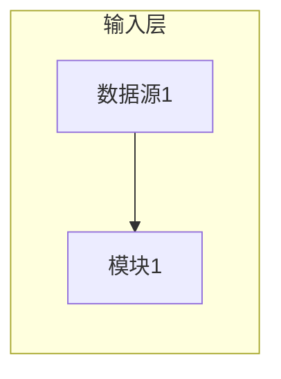
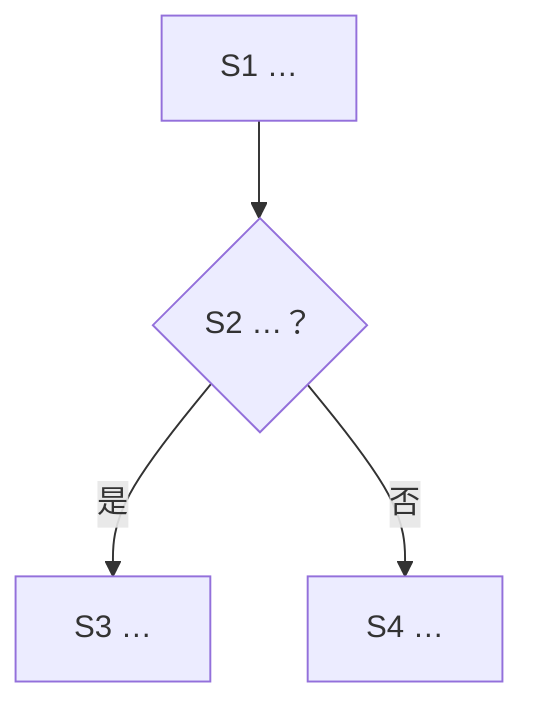

# 技术交底书

| 项目 | 内容 |
|---|---|
| 案号 | 【待确认】 |
| 交底书名称 | 一种[技术主题]方法 |
| 申请人/发明人 | 【待确认】 |
| 撰写人 | 【待确认】 |
| 撰写人电话 | 【待确认】 |
| E-mail | 【待确认】 |

## 注意事项

（1）交底书应使代理人能看懂，尤其是背景技术和详细技术方案，一定要写得全面、清楚、完整；
（2）技术的公开程度，应以本领域普通技术人员不需付出创造性劳动即可实施为准；
（3）在与代理人沟通时，对代理人咨询的技术问题应给予回答并认真讲解，并按要求及时补充技术材料。

## 缩略语和关键术语定义

| 术语 | 定义【提示：用一句人话】 |
|---|---|
| ____ | ____ |

## 一、技术背景与现有技术

### 1.1 现有技术

（总起引言段：先用几句话把本交底的技术话题引进来，再点出现有技术集中在哪些方向；后文逐段展开。）

（按技术方向：方向一——代表做法与局限；方向二——…。）

（有D1时）最接近的现有技术（D1）：[公开号+名称]，一段话介绍它怎么做（不展开细节、不逐特征比对）。

（区别段：本发明与该方案的区别在于…；与 D1 段篇幅约 1:1、至多约其 2/3。）

（无D1时：本次未钉住可作最接近现有技术的对比文件——按材料所述现有做法写。）

### 1.2 现有技术存在的缺点

（不超过6条；每条完整句，落到具体不足。）

## 二、本发明所要解决的技术问题

（效果导向的问题句；禁止出现本发明手段词。）

## 三、技术方案详细阐述

### 3.1 应用场景与总体思路
（①场景与参与者；②标题对象如何进入系统；③高频过程引导——术语定义见文首缩略语节。）

### 3.2 系统框图

### 3.3 模块功能说明
- 模块1（对应框图节点）：作用与关联。

### 3.4 方法流程

- **S1 …**：…
- **S2 …**：…

（若含前置输入准备步骤（步骤A/B等），在主链 S1 开始前加过渡句："正式方法流程如下。"）

### 3.4.1 公式

$$ … $$

式中：x 为…；y 为…；下标 c 表示…。（逐式符号说明；禁公式图片）

### 3.5 关键技术参数

| 参数 | 符号/取值 | 来源（经验/实验/可调） |
|---|---|---|

## 四、替代方案与可选实施路径

（3–4点；每点指回 3.x 某步＋代价/适用场景。）

## 五、与现有技术相比的有益效果

（不超过6条；完整效果句。）

## 六、技术关键点和欲保护点

### 6.1 技术特征关键点
（不超过6条；纯数字编号。）

1．____：特征全文复述（对应 3.4）【提示：尾注只到章/步骤号一级，不堆叠式(n)引用】

### 6.2 优选特征
- 阈值取值：…（对应 3.5）
- 分支：…（对应 3.4）

## 七、实施例及其它

（不超过2个；小节标题带 7.x 节号与实施例名。）

### 7.1 实施例一：〔主路径实施例名〕
（职责、输入输出、依赖、交付物；数字口径：结构验证/试算。）

### 7.2 实施例二：〔分支路径实施例名〕

### 附图说明

- 图1　____（与正文图题逐字一致）

### 参考文献

- CN______A，____（只列公开号与名称）
