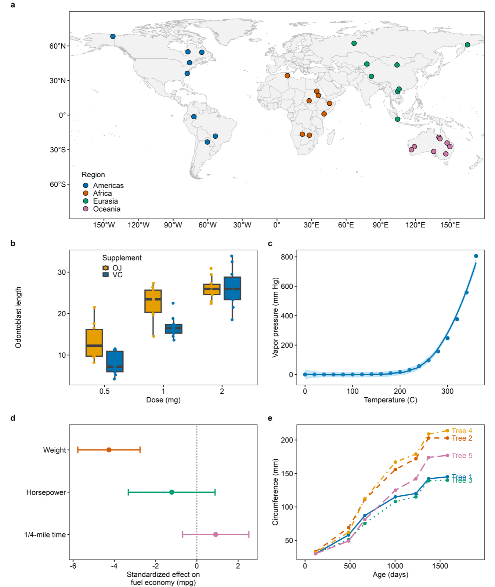
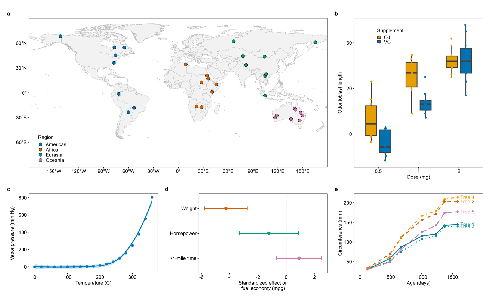

# rfigure.skill


`rfigure` 是面向论文、学位论文和生态/环境分析的 R/ggplot2 科研作图技能。它从“图要证明什么”出发，生成可以公开、独立运行的完整 R 脚本：所有参数、数据处理、主题、拼图和导出设置都写在同一个文件里。

## 示例

同一套数据、同一份契约下的两种拼图形制。两张图的经纬度标注、日界线处理、面板对齐和面积占比都由脚本在最终物理尺寸下实测校验后导出。

> 示例图中的采样点为固定随机种子生成的演示数据，统计面板使用 R 自带示例数据集，均非观测结果或研究结论。

**常规多面板**（190 mm 宽，地图独占整行，统计面板 2 × 2）



**黄金比例变体**（280 mm 宽，画布 W/H = 1.61803，底行三个统计面板实测 1.6180）



## 主要能力

- 箱线图、小提琴图、散点回归、模型效应、组成数据、矩阵、时间序列和多面板布局。
- `sf` 地图、样点叠加、投影范围和按实际渲染 panel 计算的南海插图比例。
- 空间样点默认使用同一种实心圆，以稳定配色区分类别，不再默认混用圆形、方形和三角形。
- 中国或全球空间图与统计图的组合：根据地图实际比例自动选择左右或上下结构，并检查真实矩形框对齐；可按请求生成经过实测、宽度不超过 210 mm 的黄金比例实验版。
- Arial 8 pt、四边 1 pt 边框、证据层线条加粗等统一出版样式。
- 缺失值、无穷值、重复记录、调色板对比度、轴标签和 alt text 的轻量审计。
- 受保护的 PNG、TIFF、SVG、PDF 导出，以及可选的可复现 manifest。
- 多面板默认使用小写 `a`、`b`、`c` 编号。
- 规则网格按最终渲染的黑色数据矩形框对齐，而不是只让外层画布看起来等宽等高。
- 拼图对齐后还会检查实际框体比例和数据 panel 占整张图的面积，避免用“缩小子图”换取表面对齐。
- 共享说明默认放在图外的一份 figure note 中，不在每个子图下重复挤占空间；样本量、误差线、转换、缺失值和排除规则仍会保留。
- 图例优先放进数据矩形框内经过检查的空旷区域；空间图的内部图例默认完全透明且无边框，与底图自然融合。没有安全空白时才改用直接标注或右侧/共享图例区，默认不再挤占图框上下空间。

## 安装

克隆仓库后，把整个目录放入 Codex/agent 的 skills 路径；目录名可以保留为 `rfigure.skill`：

```bash
git clone https://github.com/qwlei328-maker/rfigure.skill.git ~/.codex/skills/rfigure.skill
```

也可以安装到 `~/.agents/skills/rfigure.skill`，并按所用客户端的技能目录约定创建符号链接。新会话中以 `$rfigure` 调用。

核心 R 依赖可在新机器上这样安装：

```r
install.packages(c(
  "ggplot2", "patchwork", "ragg", "svglite", "systemfonts", "scales"
))
```

地图功能另外需要 `sf` 和 `ggmapcn`：

```r
install.packages(c("sf", "remotes"))
remotes::install_github("Rimagination/ggmapcn")
```

建议使用 ggplot2 ≥ 3.5；macOS PDF 会优先使用系统 Quartz，其他平台会在导出前实际探测 Cairo 是否可用。

## 使用方式

例如：

```text
使用 $rfigure，根据这份数据制作一张论文级分组时间序列图，保留缺失值信息，导出 180 mm 宽的 PNG 和 SVG，并检查最终渲染结果。
```

技能会优先读取精简的 `SKILL.md`，再按任务需要加载对应参考页。最终交付代码不会 `source()` 技能目录里的 `.R` 文件，也不会要求读者使用私有函数。例如：

```r
library(ggplot2)

FONT_FAMILY  <- "Arial"
TEXT_PT      <- 8
LINE_MM      <- 25.4 / 72
DATA_LINE_MM <- LINE_MM * 1.8
FIG_WIDTH_MM <- 180
FIG_HEIGHT_MM <- 110
FIG_DPI      <- 600

p <- ggplot(df, aes(x, y)) +
  geom_point() +
  labs(x = "X", y = "Y", alt = "Scatter plot of X against Y.") +
  theme_classic(base_size = TEXT_PT, base_family = FONT_FAMILY) +
  theme(
    panel.border = element_rect(
      colour = "black", fill = NA, linewidth = LINE_MM
    ),
    axis.line = element_blank(),
    panel.grid = element_blank()
  )

output_png <- "figure.png"
if (file.exists(output_png)) stop("Refusing to overwrite: ", output_png)
ggsave(
  output_png, p,
  device = ragg::agg_png,
  width = FIG_WIDTH_MM, height = FIG_HEIGHT_MM,
  units = "mm", dpi = FIG_DPI, bg = "white"
)
```

## 文件结构

```text
rfigure.skill/
├── SKILL.md
├── agents/
│   └── openai.yaml
├── assets/
│   ├── 00_eight_plot_suite_overview.png
│   ├── 01_five_panel_golden.png
│   └── 02_five_panel_standard.png
├── references/
│   ├── figure-patterns.md
│   ├── maps-and-spatial.md
│   ├── quality-and-accessibility.md
│   └── style-and-export.md
└── scripts/
    ├── check_docs.R
    ├── check_public_examples.R
    ├── five_panel_china.R     # 多面板地图合成的参考实现
    ├── map_smoke_test.R
    ├── panel_alignment_smoke_test.R
    ├── rfigure_layout.R       # 拼图几何测量与检查，拼接脚本可直接 source()
    ├── rfigure_helpers.R      # 仅供技能维护和回归测试
    └── smoke_test.R
```

## 自检

在仓库根目录运行：

```bash
Rscript scripts/check_docs.R
Rscript scripts/check_public_examples.R
Rscript scripts/smoke_test.R
Rscript scripts/map_smoke_test.R /tmp/rfigure-map-smoke
Rscript scripts/panel_alignment_smoke_test.R
Rscript scripts/five_panel_china.R
```

`map_smoke_test.R` 会检查中国主图、南海插图和插图宽度的回归值，并输出 PNG/SVG 供视觉复核。

`panel_alignment_smoke_test.R` 会在最终物理尺寸下读取每个数据 panel 的坐标，检查同列左右边、同行上下边、所有 panel 的宽高、实际框体比例和 panel 面积占比。

## 设计原则

- 最终 R 文件自包含，公开后不依赖 rfigure 的外部脚本。
- 图形参数全部可见，多面板默认使用小写 `a`、`b`、`c`。
- 普通规则拼图使用单层网格和共同的 panel 宽高比，并以数据矩形框的最终坐标、实际比例和面积占比作为验收标准。
- skill 中“不伪造、静默删除或随意抽样最终证据”等条款是对调用该 skill 的 AI 的行为约束，不是对人类用户的命令。
- 显式记录转换、统计量、置信区间和地图数据来源。
- 重要类别不只依赖颜色，必要时同时使用形状、线型或直接标注。
- 最终判断以导出文件为准，而不是只看 RStudio 预览。

## 更新日志

### 2026-08-20（补丁）

冷启动测试：由一个只拿到仓库地址、不看任何本地上下文的代理克隆本仓库、只读仓库文档完成一张多面板地图拼图。它成功交付，同时报回一批文档缺陷，以下为经复现后修正的部分。

- **交付契约与最终清单自相矛盾**：清单仍写着"交付脚本不得调用本技能的 helper"，与新的两级契约冲突。已改为：每个图脚本自包含，拼接脚本仅可 `source()` `scripts/rfigure_layout.R` 并在开头声明。
- **`references/style-and-export.md` 第 5 节的模板仍带 `widths`/`heights`**，而同一文件第 6 节明确指出这么写会让 `theme(aspect.ratio)` 静默失效。照抄模板的人必然踩坑；模板已修正。
- **日界线切割配方在最需要它的场景下无效**。实测（sf 1.1.x，Natural Earth）：s2 开启时 `lon_0 = 178` 仍残留 Antarctica / Fiji / Russia，`scale = "small"` 直接抛 `Loop 0 is not valid`；s2 关闭后 `medium` 在两种中央经线下均干净。配方改为在函数内临时关闭 s2 并 `st_collection_extract()`（`st_difference` 可能返回 GEOMETRYCOLLECTION，而 `st_coordinates()` 对它没有方法，会让验证步骤本身崩掉）。补充了实测对照表、Antarctica 绕极的说明，以及"跳变判据依赖 −180…180 坐标框，`st_shift_longitude()` 之后会误判"的提示。
- **`rfigure_measure_panels()` 的面板字母是按实测位置排的，不是 patchwork 的真实 tag**。共享同一行的面板 `top_mm` 可能只差 1e-14 mm，排序方向由浮点噪声决定，进而让按字母取面板的查找取错矩形。排序键现在先按物理容差取整（`order_tolerance_mm`，默认 0.1 mm），文档也写明该列是位置标签、可用 `tag_labels` 覆盖。
- **面积占比阈值**：正文的"面板越多占比越低"过度概括，与参考实现的 0.52 冲突。改为按设计而非面板数解释，并说明跨行大地图会把占比拉回去。
- 新增两条实测提示：无设备时 `ggplotGrob()` 等度量会回退到 PostScript 字体（Arial 找不到，标定漂移零点几毫米），必须先开设备；`assert_graticule_labelled()` 只保证标签存在，不保证相邻标签不重叠，密集断点需自行测量物理间距。


### 2026-08-20

本次更新的重点是：把"看起来对"换成"量出来对"。所有新增规则都附带在 ggplot2 4.0.3 / patchwork 1.3.2 上的实测值，几个长期存在的静默失效也一并修掉。

**交付契约拆分为两类**

- 子图脚本仍必须自包含：审稿人要能脱离本技能运行和审查每一个面板的代码。
- 拼接脚本可以 `source()` `scripts/rfigure_layout.R`。理由是审稿人读面板代码而非拼接代码，很多人本来就在 PPT/Illustrator 里手工拼图。该文件只含几何测量与检查，不含主题、配色、标度或导出参数。

**从"五面板"泛化到任意面板数**

- `Five-Panel Standard` 更名为 `Multi-Panel Map Synthesis`：一张锚定地图 + N−1 个统计面板，五面板只是 N = 5 的一个较难案例。
- `rfigure_check_grid()` 从实测边缘反推行列，不再需要为每个 `design` 手写偏差向量，跨列面板无需特例。2/3/4/5/6 面板均已回归；容差边界处精确翻转（注入 0.34 mm 通过、0.36 mm 失败），把某面板挪到真正的另一列不会误报。
- `rfigure_measure_panels()` 提供 `expected_panels` 参数：`wrap_elements()` 会为一个可见面板吐出两个同深度 viewport，旧代码靠硬编码 `!= 5L` 挡住，现在会折叠重合矩形并在数目不符时报错。

**画布尺寸规则**

- 多面板拼图总宽 ≤ 210 mm（A4 纸宽），否则放进 Word 会被缩放，8 pt 字掉到不可读、1 pt 边框变虚；高度不设限。
- 单图不受限，按证据本身定尺寸。
- 明确请求的黄金比例变体豁免该上限，但需报告宽度及缩放后果。

**黄金比例：由"点"改为"带"**

拆成三个互不相同的数字：画布比近乎精确（容差 0.005）、面板比落入 `[1.50, 1.75]` 带内、渲染保真度 0.005（用于抓被布局丢弃的 `aspect.ratio`，不可放宽）。依据是实测：190 mm 黄金画布上行高被画布卡死，面积占比在 1.50 / 1.618 / 1.75 处分别为 0.504 / 0.544 / 0.588——强求精确黄金等于白白多要 30 mm 纸宽。新增 `rfigure_check_ratio_band()`。

**空间图**

- 投影改为可配置，并提供命名 registry（`plate_carree` / `behrmann` / `robinson` / `equal_earth` / `china_albers` / `china_lcc`），按用途给默认值；面积或密度类论断必须使用等积投影。
- 默认绘制经纬网与小数度标注（左、下两侧）；**不再默认绘制指北针**，经纬网已表明方向。
- 日界线：`st_make_valid()` 在 s2 默认开启时会把俄罗斯、斐济跨线缝合，渲染为横贯全图的横线。提供切割函数与**环顶点跳变检测**——bbox 判据不可用，它会把正确的图判错、把错误的图判对。
- 外框、经纬网与投影三者联动：曲线经纬网投影上撤掉网格会连带丢失纬度标注（实测左轴标签 5 → 1），只有矩形投影能做到"无网格 + 有标注"。
- 世界地图宽高比实测表（Robinson / Equal Earth / Mollweide / Plate Carrée × 三档纬度窗），及其布局后果：地图独占整行；黄金变体中必然豁免；裁掉极点会让地图更宽而不是更窄。
- 经纬网标注断言改为检查**实际渲染出的轴标签文本**；旧的几何判据（经纬线是否触及边缘）会误杀所有世界地图。

**修掉的静默失效**

- `theme(aspect.ratio)` 与 patchwork 显式 `widths`/`heights` 同时使用时被静默丢弃：请求 0.618 实渲 0.570，与完全不设一致。原模板同时写了两者，自带冒烟测试因容差过松（0.03）而"通过"；模板已改，容差收紧至 0.005。
- 完整主题覆盖在先的 `theme()`：`theme_classic()` 带 `legend.position = "right"`，写在自定义 `theme()` 之后会把内部图例设置整个丢弃。
- sidecar caption 编码：C locale 下 `writeLines()` 把度符号写成字面量 `<U+00B0>`，改用 `writeLines(enc2utf8(x), path, useBytes = TRUE)`。
- 内层矩形匹配：`which.max(面积)` 在存在 `aspect.ratio` 面板时会选错面板，改为按包含关系匹配（`rfigure_match_inner()`）。
- 模板中的硬编码验收常数（`1.2831` / `0.8750` / `0.1910`）改为不变量——它们是某一个视口的属性，复制模板后改视口会死在与本图无关的断言上。
- `TEXT_GG` 三种写法统一为 `TEXT_PT / ggplot2::.pt`。
- 其它：`ifelse()` 标量条件导致半球后缀全错、`parse = TRUE` 下运算符掉出指定字体、`scale limits` 静默丢行、时间序列缺口在最终尺寸下不可见、防覆盖与反复渲染检查冲突（新增 `OVERWRITE` 开关）。

### 更早

- 按实测渲染 panel 计算南海插图比例，替代按四角 bbox 估算。
- 增加中国地图插图相关规则。
- 首次发布。
