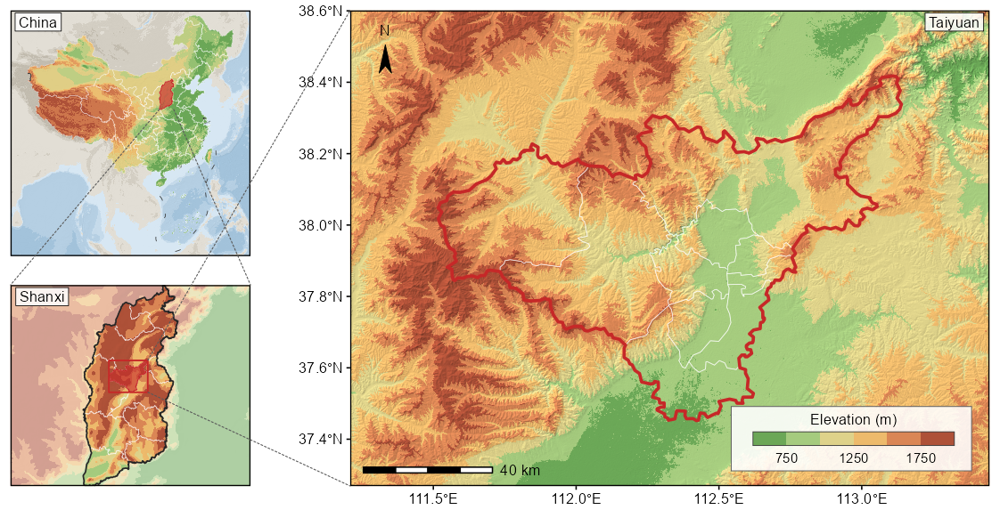
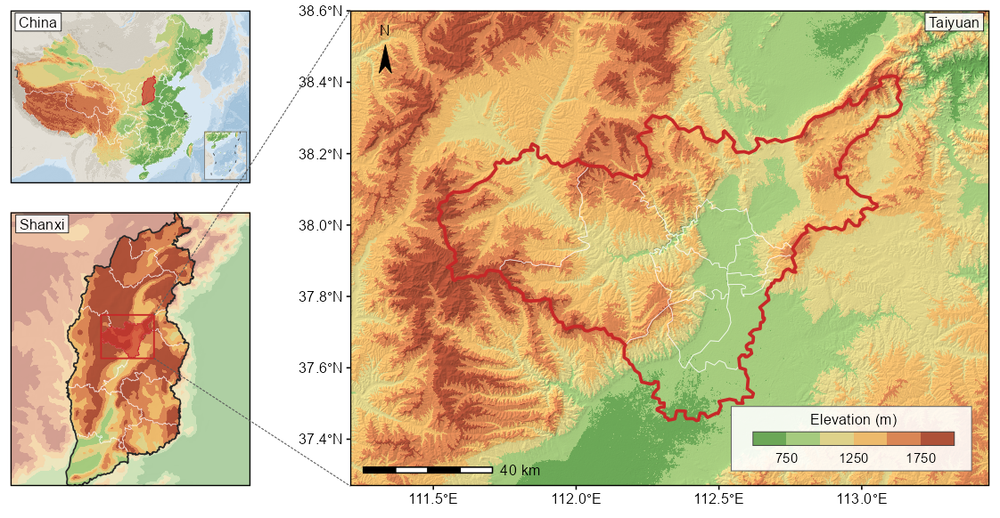
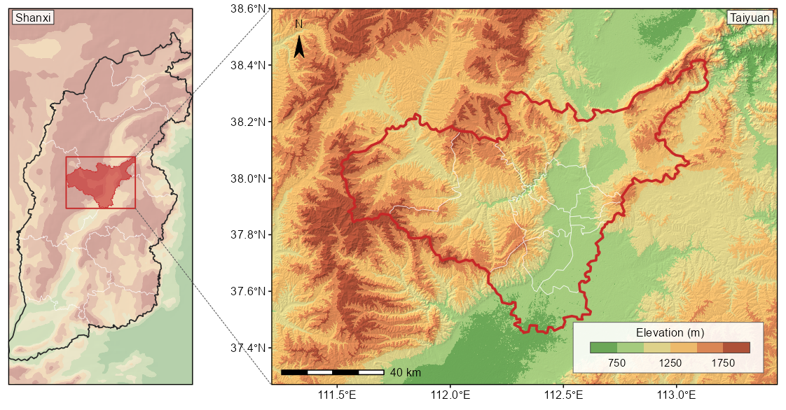
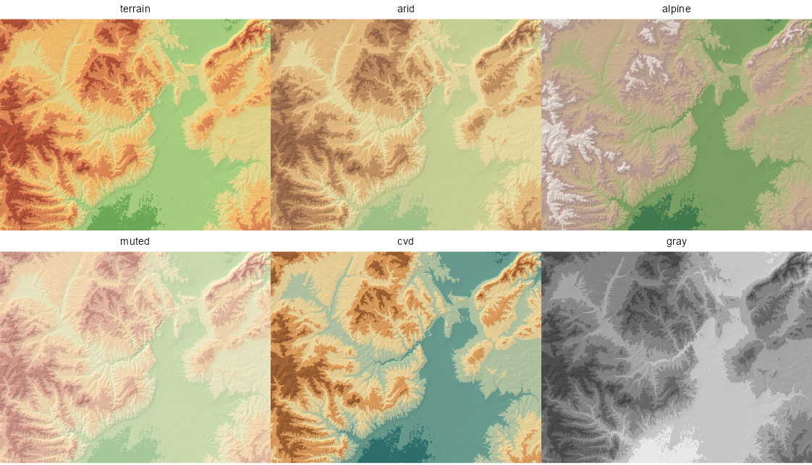

# study-area-map.skill

> **本项目已并入 [xiaoyu-skill](https://github.com/keros68/xiaoyu-skill/tree/main/skills/study-area-map)。本仓库保留为只读历史入口，后续更新请前往新仓库。**

用 R 绘制论文研究区区位图的 Claude Code 技能。基于 ggplot2、sf、terra。

负责快速搭出框架：投影、窗口、面板对齐、地形合成、图廓件。配色、留白、标注位置与要素取舍出图后自行调整。

## 功能

- 多级定位面板（国家、省、研究区），各级图框等宽
- 分层设色地形底图，山影按相乘合成，分级边界和饱和度都保留
- 缩放引线，虚线锥连接相邻两级面板
- 图内图例、针形指北针、比例尺
- 投影窗口、DEM 缺值、图廓件压框、角框压盖陆地、强调色撞色、色带可分辨性，均自带断言

## 安装

```bash
git clone https://github.com/keros68/study-area-map.skill.git \
  ~/.claude/skills/study-area-map
```

放在 `~/.claude/skills/` 下全部项目可用，放在项目的 `.claude/skills/` 下仅该项目可用。

## 用法

两个模块自带线宽、字号、字体注册与地图主题，加载后即可用。

```r
SK <- "~/.claude/skills/study-area-map/reference/"
source(paste0(SK, "relief_basemap.R"))
source(paste0(SK, "palettes.R"))

CRS_M <- "+proj=aea +lat_1=39.3 +lat_2=40.4 +lat_0=39.85 +lon_0=113.3 +datum=WGS84 +units=m +no_defs"

# 窗口：经纬矩形投影后是弯的四边形，取内接矩形，栅格才能铺满图框
W <- inscribed_window(c(112.0, 114.6), c(39.02, 40.80), CRS_M)

# 地形：分级边界由这份 DEM 自身的 2–98 分位推出，不沿用别处的边界
dem  <- load_dem("F:/DEM", "ASTGTMV003_.*_dem[.]tif$", CRS_M, W, fact = 3)
brk  <- elev_breaks(dem, n = 6)
cols <- pal_hypso("terrain", length(brk) - 1)
rel  <- relief_rgb(dem, brk, cols, strength = 0.42)

ggplot() +
  tidyterra::geom_spatraster_rgb(data = rel) +
  geom_sf(data = aoi, fill = NA, colour = "#C62828", linewidth = LW_DAT * 1.3) +
  north_needle(W) +
  elev_legend_block(W, cols, elev_labels(brk), panel_h_mm = 90) +
  coord_sf(xlim = W[c("xmin", "xmax")], ylim = W[c("ymin", "ymax")],
           expand = FALSE) +
  theme_map_pub()
```

图面内的图例落在研究区上，是窗口贴着研究区取的必然结果：没有空角可放。`pad_until_clear()` 放大窗口直到图例区不压研究区，研究区因此画得小一些，让出的边缘正是图例落脚的地方。示例的太原窗口由此定在 19%。另一条路是把图例移到图框外，两者都成立。

图例内部的行距按毫米排，所以要传面板高度。行距若按比例给，文字高度是固定的毫米数，面板一小文字占比就变大，刻度数字会压到图例自己的边框上。

`coord_sf()` 必须排在所有 `geom_sf()` 之后。`geom_sf()` 自带一个默认 `coord_sf()`，排在其后会替换掉已设的窗口，面板退回数据全域。`assert_window(p, W)` 用于核验。

多面板拼版的顺序与单幅相反：先用 `pin_panel()` 把各面板尺寸定死，再用 `gridExtra::arrangeGrob()` 按毫米拼，最后由 `box_in()` 算出引线端点。完整流程见 `SKILL.md`。

## 示例

`example/` 下两个脚本可以照着改，各出 300 dpi 成品与 150 dpi 预览两版。

三级版，`SCS_INSET <- FALSE`，窗口取全部要素，南海落在正图内，三级引线齐全：



三级版，`SCS_INSET <- TRUE`，正图只放陆域，南海作角框。角框与引线锥占同一块地方，因此只保留山西到主图那一段引线，中国到山西由红色块本身指示：



两级版，定位面板整体去饱和：



示例需要三样数据：覆盖 N37–N38 / E111–E113 的 ASTER 压缩瓦片、含市县两级的行政区划 shp，以及自动下载的 GEBCO。脚本开头的路径改成自己的即可。压缩瓦片不必解包，`vsizip_tiles()` 会读归档拼出 GDAL 虚拟路径。

## 自备数据

仓库不含 shapefile 和栅格。

不备数据也能出图：GEBCO 由 `ggmapcn::check_geodata()` 自动下载，可以画出带图例、指北针与图框的地形底图。研究区轮廓与行政边界必须自备 shp，否则图上只有地形。

| 用途 | 来源 | 说明 |
|---|---|---|
| 研究区轮廓、行政边界 | 自备 shp | 各地区来源不同。中国境内的边界可用自然资源部标准地图服务（bzdt.ch.mnr.gov.cn）下载的标准地图。图注需写明出处与版本 |
| 研究区面板 30 m | ASTER GDEM v3（NASA Earthdata） | 需登录，手动下载瓦片，`load_dem()` 负责合并 |
| 研究区面板 30 m | Copernicus DEM GLO-30 | 开放，无需登录 |
| 国家级面板 | GEBCO 2024，经 `ggmapcn::check_geodata()` | 0.05°，约 24 MB，自动下载 |

本仓库示例的行政边界用「中国省市县标准行政区划数据 审图号GS（2024）0650号」，最终以使用者自备的版本为准。图件是否符合发表要求由使用者自行判断。

GEBCO 为 0.05°，约 5 km，用于国家级面板合适，用于省级面板偏粗。省级面板重采样到 700 m 显示后，图注须写明是概化地形。研究区面板需要真实 30 m DEM。

`ggmapcn` 的 jsDelivr 镜像返回 HTTP 403，函数会自行回退到 `raw.githubusercontent.com`。

## 配色

六条色带，按低地是什么来选。

| 名称 | 低 → 高 | 适用 |
|---|---|---|
| `terrain` | 绿 → 黄 → 橙 → 红褐 | 通用 |
| `arid` | 浅灰绿 → 麦秆 → 棕褐 | 低地是荒漠，绿色会误示植被 |
| `alpine` | 深绿 → 橄榄 → 灰褐 → 浅岩色 | 高差大，顶档应读作裸岩 |
| `muted` | terrain 去饱和 | 底图要承载大量叠加符号 |
| `cvd` | 蓝绿 → 卡其 → 橙 → 褐 | 避开红绿轴 |
| `gray` | L\* 等距灰阶 | 黑白印刷 |

`cols` 处处是普通字符向量，别的色带照样能用：`relief_rgb(dem, brk, viridisLite::viridis(6))`。

`preview_hypso(dem)` 用同一份 DEM 把全部色带各画一遍：



`check_ramp(cols)` 报相邻两类在正常视觉、色盲与灰度下的最小 Lab 距离。6 级实测：

| 色带 | 正常 | 绿色盲 | 红色盲 | 灰度 |
|---|---|---|---|---|
| `terrain` | 17.1 | 9.2 | 4.7 | 4.7 |
| `arid` | 9.7 | 5.7 | 4.0 | 5.4 |
| `alpine` | 12.6 | 4.9 | 8.0 | 1.5 |
| `muted` | 9.1 | 5.4 | 4.9 | 2.5 |
| `cvd` | **18.1** | **19.0** | **14.5** | 8.4 |
| `gray` | 11.7 | 11.7 | 11.7 | **11.7** |

彩色分层设色的灰度距离为 1.5 至 8.4，黑白印刷用 `gray`。`cvd` 是唯一在色盲下仍保持分离的彩色色带。级数取 5 至 8：`terrain` 的正常视觉距离从 5 级的 21.4 降到 10 级的 9.4，红色盲下从 2.5 降到 0.5。阈值 10 是经验值，低于它两档的边界在 8 pt 图例上就看不出来。判定默认只算正常视觉与两种色盲，黑白印刷时把 `"gray"` 加进 `require`。

## 模块

| 文件 | 内容 |
|---|---|
| `reference/relief_basemap.R` | `ensure_font()` `theme_map_pub()` `inscribed_window()` `bbox_union()` `vsizip_tiles()` `fit_aspect()` `win_aspect()` `load_dem()` `locate_na()` `relief_rgb()` `north_needle()` `elev_legend_block()` `legend_backing()` `assert_inside()` `assert_window()` `inset_is_clear()` `assert_inset_clear()` `widen_for_inset()` `pad_win()` `pad_until_clear()` `inset_aspect()` `corner_inset()` `credit_footer()` `check_cn_content()` `pin_panel()` `panel_margins()` `with_font_device()` `box_in()` `add_leaders()` `FRAME_PAD` `CN_REQUIRED_POINTS` |
| `reference/palettes.R` | `pal_hypso()` `elev_breaks()` `elev_labels()` `preview_hypso()` `check_ramp()` `simulate_cvd()` `to_gray()` `assert_accent_unique()` `PAL_SURROUND` `BRK_SURROUND` |

两处做法与常见写法不同。

`relief_rgb()` 先按高程分箱取色，再乘以归一到均值 1 的山影系数，直接输出 RGB 栅格。山影只改变明暗，分级边界与饱和度都保留。常见的 alpha 叠压是朝下层插值，调高埋掉地形，调低埋掉颜色。`wash` 参数把颜色朝白色插值，供需要承载大量叠加符号的底图使用。

色带可复用，分级边界不可复用。`elev_breaks(d, n)` 从该 DEM 自身的分位算出整数级差，首末开区间吸收长尾。

## 环境

R ≥ 4.3，ggplot2 ≥ 3.5，另需 sf、terra、tidyterra、ragg、systemfonts、gridExtra。`ggmapcn` 仅在使用 GEBCO 国家级底图时需要。

已验证组合：R 4.6.1，ggplot2 4.0.3，sf 1.1.2（GDAL 3.12.1）。

## 致谢

排版取值（8 pt 正文、1 pt 结构线、数据线加重、物理尺寸导出）沿用 [rfigure.skill](https://github.com/qwlei328-maker/rfigure.skill) 的约定。本技能自带这些常量，不需要另外安装。已有 rfigure.skill 的用户可以照旧用 `theme_qw_pub()`。

国家级面板的 GEBCO 底图经 [ggmapcn](https://github.com/Rimagination/ggmapcn) 获取。

## 许可

MIT
