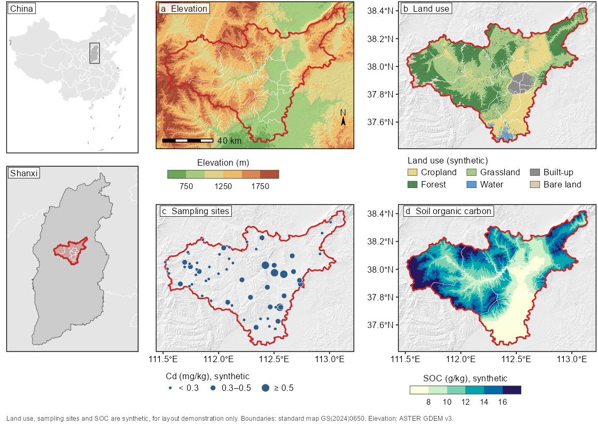
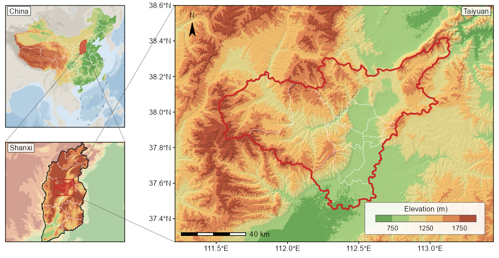
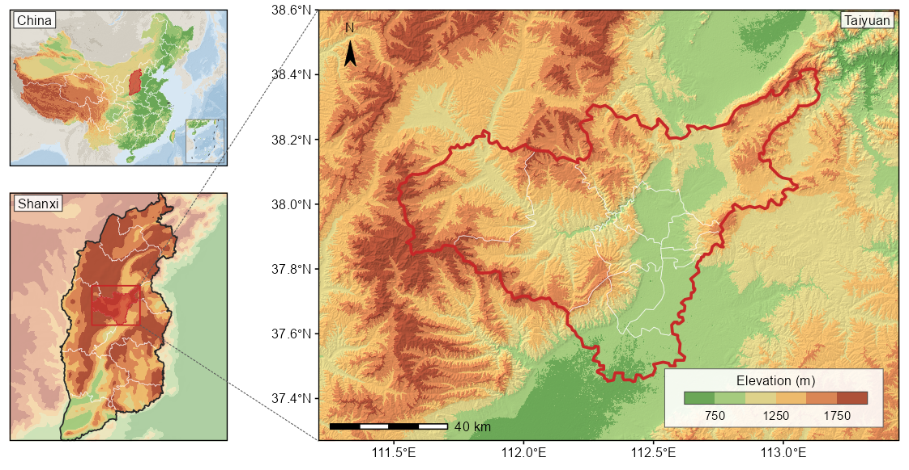
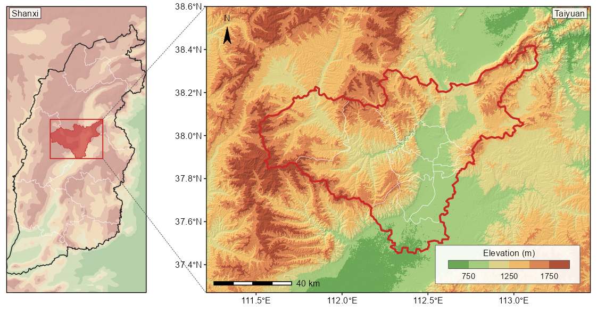
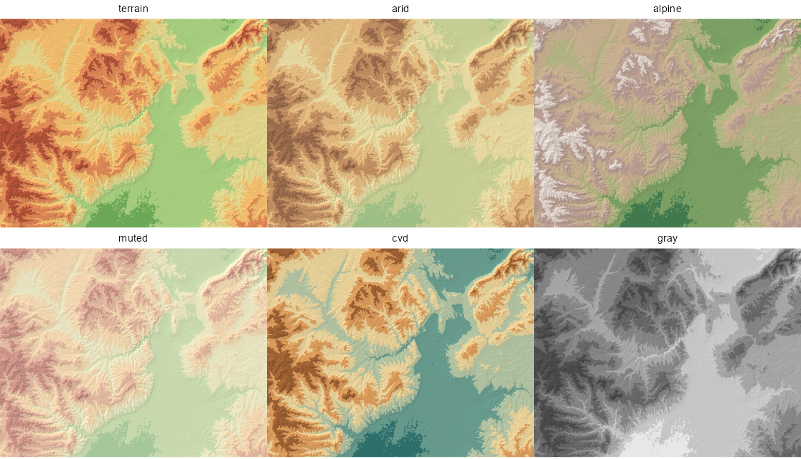

# study-area-map

用 R（ggplot2、sf、terra）绘制论文研究区区位图的 AI agent skill。

负责搭出投影、窗口、地形底图、专题图层、面板对齐和图廓件；配色、留白、标注和要素取舍出图后自行调整。

## 功能

- 多级定位面板（国家、省、研究区），各级图框等宽
- 分层设色地形底图，山影按相乘合成，分级边界和饱和度都保留
- 专题图层：土地利用等分类栅格、分级设色的连续变量、分级符号的采样点
- 一张定位图配多幅专题图，共用窗口，经纬度只标外侧，图例放在面板下方的图例条
- 缩放引线，虚线锥连接相邻两级面板
- 图内图例、针形指北针、比例尺
- 自带断言：投影窗口、DEM 缺值、图廓件压框、角框压陆地、强调色重复、色带可分辨性

## 安装

任选一种，同一台电脑只装一份。

**skills.sh（推荐，需要 Node.js）**

```bash
npx skills add keros68/xiaoyu-skill --skill study-area-map -g
```

用 `-a claude-code` 指定 Agent；更新用 `npx skills update -g`。

**交给 Agent 安装**：把下面这段发给正在用的 Agent：

```text
用 skills.sh 安装 keros68/xiaoyu-skill 里的 study-area-map：运行
npx skills add keros68/xiaoyu-skill --skill study-area-map -g -a <你自己对应的 agent 名，如 claude-code、codex、kimi-code-cli、pi>
不要手动复制文件。装完检查本机是否有 R ≥ 4.3 和这些包：ggplot2（≥ 3.5）、sf、terra、tidyterra、ragg、systemfonts、gridExtra；用 GEBCO 国家级底图时还要 ggmapcn。缺什么列给我，经我同意再安装。
装完提醒我新开会话，并告诉我装好的 study-area-map/reference/ 的完整路径。
```

**克隆后复制**

```bash
git clone https://github.com/keros68/xiaoyu-skill.git ~/xiaoyu-skill
cp -R ~/xiaoyu-skill/skills/study-area-map ~/.claude/skills/study-area-map
```

放在 `~/.claude/skills/` 下所有项目可用，放在项目的 `.claude/skills/` 下仅该项目可用。

## 使用

说"用 study-area-map 给我的研究区画一张两级区位图"。正常工作时的表现：

- 复制 `example/` 中最接近的脚本（两级 `taiyuan_locator.R`，三级 `taiyuan_three_level.R`，配专题图 `taiyuan_thematic.R`），改开头的数据块。
- 动手前先确定定位级数、主面板内容、底图深浅、强调色、图例和图廓件位置。
- 输出 300 dpi PNG 和 150 dpi 预览。
- 窗口错误、DEM 缺值、图例压框、角框压陆地或强调色重复时，断言报错，不出图。

## R 调用

模块自带线宽、字号、字体注册与地图主题，加载即可用。

```r
SK <- "~/.claude/skills/study-area-map/reference/"   # 改成实际安装位置
source(paste0(SK, "relief_basemap.R"))
source(paste0(SK, "palettes.R"))
source(paste0(SK, "thematic.R"))        # 需要专题图层时

CRS_M <- "+proj=aea +lat_1=39.3 +lat_2=40.4 +lat_0=39.85 +lon_0=113.3 +datum=WGS84 +units=m +no_defs"

# 窗口：经纬矩形投影后是弯的四边形，取内接矩形，栅格才能铺满图框
W <- inscribed_window(c(112.0, 114.6), c(39.02, 40.80), CRS_M)

# 地形：分级边界由这份 DEM 自身的 2–98 分位推出，不沿用别处的边界
dem  <- load_dem("F:/DEM", "ASTGTMV003_.*_dem[.]tif$", CRS_M, W, fact = 3)
brk  <- elev_breaks(dem, n = 6)
cols <- pal_hypso("terrain", length(brk) - 1)
rel  <- relief_rgb(dem, brk, cols, strength = 0.42)

ggplot() +
  tidyterra::geom_spatraster_rgb(data = rel) +
  geom_sf(data = aoi, fill = NA, colour = "#C62828", linewidth = LW_DAT * 1.3) +
  north_needle(W) +
  elev_legend_block(W, cols, elev_labels(brk), panel_h_mm = 90) +
  coord_sf(xlim = W[c("xmin", "xmax")], ylim = W[c("ymin", "ymax")],
           expand = FALSE) +
  theme_map_pub()
```

窗口贴着研究区取时，图内图例会压住研究区。`pad_until_clear()` 逐步放大窗口，直到图例不压研究区（示例太原窗口放大 19%）；也可把图例移到图框外。

图例行距按毫米计算，需传入面板高度 `panel_h_mm`；按比例计算时，小面板上的刻度数字会压到图例边框。

`coord_sf()` 须放在所有 `geom_sf()` 之后，否则窗口会被默认坐标系覆盖。可用 `assert_window(p, W)` 核验。

多面板拼版：先用 `pin_panel()` 固定各面板尺寸，再用 `gridExtra::arrangeGrob()` 按毫米拼接，最后由 `box_in()` 计算引线端点。完整流程见 `SKILL.md`。

## 示例

`example/` 下三个脚本可直接改用，仓库只保存 150 dpi 预览图。

两级定位图配四幅专题图（地形、土地利用、采样点、土壤有机碳），共用窗口，图例在面板下方。后三幅为固定随机种子生成的模拟数据，仅演示版式：



三级版，`SCS_INSET <- FALSE`，南海在正图内，三级引线齐全：



三级版，`SCS_INSET <- TRUE`，南海作角框。角框占用了引线位置，只保留山西到主图的引线：



两级版，定位面板整体去饱和：



运行示例需要：覆盖 N37–N38 / E111–E113 的 ASTER 压缩瓦片、含市县两级的行政区划 shp，以及自动下载的 GEBCO。改脚本开头的路径即可；压缩瓦片无需解压，`vsizip_tiles()` 直接读取。

## 自备数据

仓库不含 shapefile 和栅格。

不备数据时，可用自动下载的 GEBCO 画出带图例、指北针和图框的地形底图。研究区轮廓与行政边界需自备 shp。ArcGIS 打包文件和 MapGIS 6.x 图层的读取方法见 `guides/data-sources.md`。

| 用途 | 来源 | 说明 |
|---|---|---|
| 研究区轮廓、行政边界 | 自备 shp | 各地区来源不同。中国境内的边界可用自然资源部标准地图服务（bzdt.ch.mnr.gov.cn）下载的标准地图。图注需写明出处与版本 |
| 研究区面板 30 m | ASTER GDEM v3（NASA Earthdata） | 需登录，手动下载瓦片，`load_dem()` 负责合并 |
| 研究区面板 30 m | Copernicus DEM GLO-30 | 开放，无需登录 |
| 国家级面板 | GEBCO 2024，经 `ggmapcn::check_geodata()` | 0.05°，约 24 MB，自动下载 |

示例行政边界为「中国省市县标准行政区划数据 审图号GS（2024）0650号」。图件是否符合发表要求由使用者判断。

GEBCO（0.05°，约 5 km）适合国家级面板，用于省级面板偏粗，需在图注写明为概化地形。研究区面板需用 30 m DEM。

`ggmapcn` 的 jsDelivr 镜像返回 HTTP 403 时，会自动改从 `raw.githubusercontent.com` 下载。

## 配色

六条色带，按低地类型选择。

| 名称 | 低 → 高 | 适用 |
|---|---|---|
| `terrain` | 绿 → 黄 → 橙 → 红褐 | 通用 |
| `arid` | 浅灰绿 → 麦秆 → 棕褐 | 低地是荒漠，绿色会误示植被 |
| `alpine` | 深绿 → 橄榄 → 灰褐 → 浅岩色 | 高差大，顶档应读作裸岩 |
| `muted` | terrain 去饱和 | 底图要承载大量叠加符号 |
| `cvd` | 蓝绿 → 卡其 → 橙 → 褐 | 避开红绿轴 |
| `gray` | L\* 等距灰阶 | 黑白印刷 |

`cols` 是普通颜色向量，也可传入其他色带：`relief_rgb(dem, brk, viridisLite::viridis(6))`。

`preview_hypso(dem)` 用同一份 DEM 预览全部色带：



`check_ramp(cols)` 计算相邻两级在正常视觉、色盲和灰度下的最小 Lab 距离。6 级实测：

| 色带 | 正常 | 绿色盲 | 红色盲 | 灰度 |
|---|---|---|---|---|
| `terrain` | 17.1 | 9.2 | 4.7 | 4.7 |
| `arid` | 9.7 | 5.7 | 4.0 | 5.4 |
| `alpine` | 12.6 | 4.9 | 8.0 | 1.5 |
| `muted` | 9.1 | 5.4 | 4.9 | 2.5 |
| `cvd` | **18.1** | **19.0** | **14.5** | 8.4 |
| `gray` | 11.7 | 11.7 | 11.7 | **11.7** |

- 黑白印刷用 `gray`；彩色色带的灰度距离只有 1.5–8.4。
- 色盲读者用 `cvd`，它是唯一在色盲下仍可区分的彩色色带。
- 级数建议 5–8。`terrain` 从 5 级增到 10 级时，正常视觉距离由 21.4 降到 9.4，红色盲下由 2.5 降到 0.5。
- 距离阈值 10 为经验值，低于此值时 8 pt 图例上难以分辨相邻两级。默认只检查正常视觉和两种色盲，黑白印刷时在 `require` 中加入 `"gray"`。

## 模块

| 文件 | 内容 |
|---|---|
| `reference/relief_basemap.R` | `ensure_font()` `theme_map_pub()` `shade_factor()` `inscribed_window()` `bbox_union()` `vsizip_tiles()` `fit_aspect()` `win_aspect()` `load_dem()` `locate_na()` `relief_rgb()` `north_needle()` `elev_legend_block()` `legend_backing()` `frac_fun()` `assert_inside()` `assert_window()` `inset_is_clear()` `assert_inset_clear()` `widen_for_inset()` `pad_win()` `pad_until_clear()` `inset_aspect()` `corner_inset()` `credit_footer()` `check_cn_content()` `pin_panel()` `panel_margins()` `with_font_device()` `box_in()` `add_leaders()` `FRAME_PAD` `CN_REQUIRED_POINTS` |
| `reference/palettes.R` | `pal_hypso()` `elev_breaks()` `elev_labels()` `preview_hypso()` `check_ramp()` `simulate_cvd()` `to_gray()` `assert_accent_unique()` `PAL_SURROUND` `BRK_SURROUND` |
| `reference/thematic.R` | `class_rgb()` `graduated_sizes()` `legend_rows_block()` `assert_within_reserved()` `mm_win()` `legend_panel()` |

原理与实测数据见 `guides/`：窗口与投影、地形底图、专题图层、拼版与引线、图廓件、数据来源，共六篇。

- `relief_rgb()` 先按高程分级取色，再乘以均值为 1 的山影系数，输出 RGB 栅格。山影只改变明暗，分级边界和饱和度不变；常见的 alpha 叠加则会削弱地形或颜色。`wash` 参数把颜色向白色淡化，用于需要叠加大量符号的底图。
- 色带可复用，分级边界不复用：`elev_breaks(d, n)` 按当前 DEM 的分位数计算整数级差，首末两级为开区间。

## 环境

R ≥ 4.3，ggplot2 ≥ 3.5，另需 sf、terra、tidyterra、ragg、systemfonts、gridExtra。`ggmapcn` 仅在使用 GEBCO 国家级底图时需要。

已验证组合：R 4.6.1，ggplot2 4.0.3，sf 1.1.2（GDAL 3.12.1）。

## 致谢

排版取值（8 pt 正文、1 pt 结构线、数据线加重、物理尺寸导出）沿用 [rfigure.skill](https://github.com/qwlei328-maker/rfigure.skill) 的约定，常量已内置，无需另装；已装 rfigure.skill 的可继续用 `theme_qw_pub()`。

国家级面板的 GEBCO 底图经 [ggmapcn](https://github.com/Rimagination/ggmapcn) 获取。

## 许可

MIT

---

**同系列 Agent Skills**：[sci-select](../sci-select/)（选刊+投稿前审查） · [academic-reference-matcher](../academic-reference-matcher/)（文献引用） · [abstract-fig](../abstract-fig/)（图形摘要） · [cugb-doctoral-thesis-format](../cugb-doctoral-thesis-format/)（学位论文格式） · [ai-cross](../ai-cross/)（多模型交叉验证）｜[返回总览](../../)
