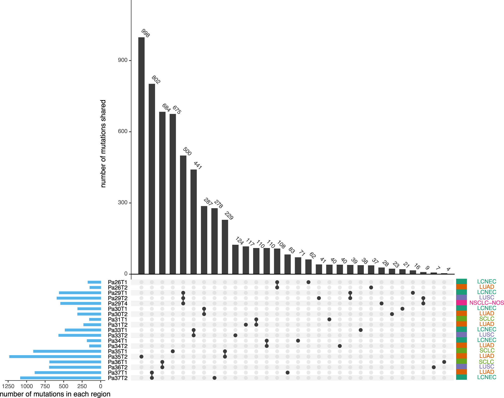
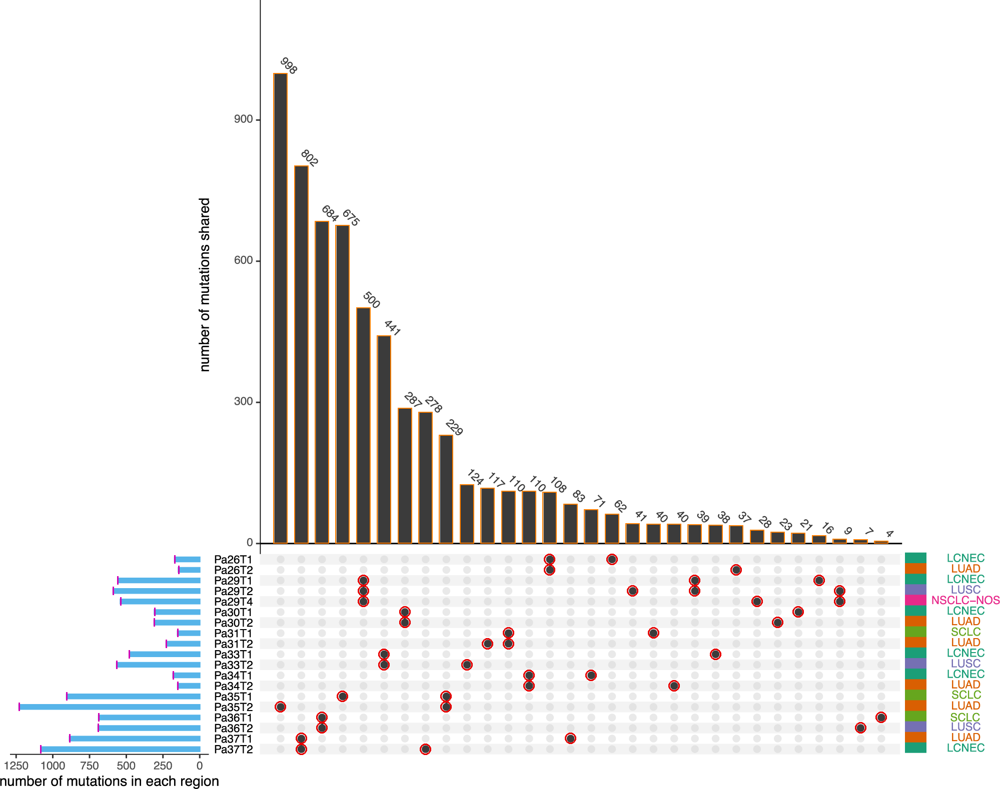
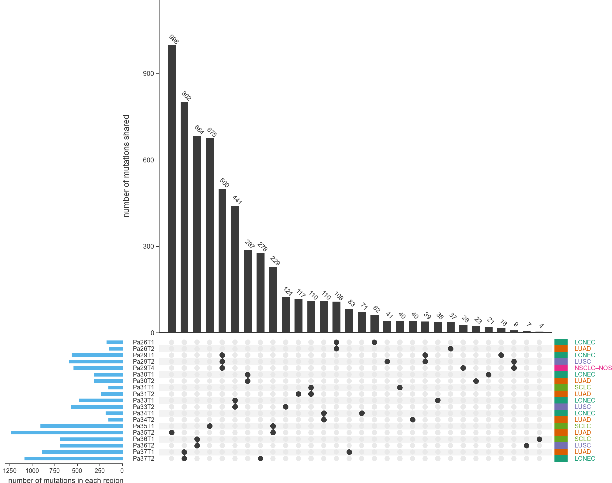

<p align="center">
  
</p>

<p align="center">
  <a href="#一分钟开始"></a>
  <a href="#结果长什么样"></a>
  <a href="LICENSE"></a>
</p>

# THU Digitizer

THU Digitizer 是一个面向科研图表数字化的本地工具，用于从图表图片和论文 PDF 中恢复图上可见、坐标可校准的数据。它会先确认图表类型、目标面板和坐标体系，再选择相应的提取流程，生成 CSV、提取覆盖图和可复核报告。

项目强调“有证据地提取”，而不是自动猜值。每项结果都会尽量保留原图坐标、校准信息、运行参数和置信状态；看不清、被遮挡或无法唯一判断的内容会明确标记为 `low_confidence` 或 `not_extracted`。这些结果适合用于论文复核、图表重绘、系统综述和复现研究。

## 一分钟开始

### 使用 Agent

先把仓库安装为 skill：

```text
请帮我安装这个 skill：
https://github.com/Rimagination/thu-digitizer
```

然后发送图表图片或论文 PDF：

```text
请用 THU Digitizer 提取这张图中的可见数据，先确认图表类型、目标面板和坐标，
并保留 CSV、提取覆盖图、JSON 报告和未提取项。
```

如果输入是 PDF，请同时说明页码和目标面板。需要与作者公开的 XLSX/CSV 比较时，可以继续说：

```text
请用官方源数据独立验证提取结果，不要覆盖原始提取 CSV。
```

## 结果长什么样

> **查看当前适用的图片类型：** 打开[在线画廊](https://rimagination.github.io/thu-digitizer/#types)。画廊按散点图、柱状图、分布图、矩阵与复合图等类型整理当前案例，并标明每个案例的提取状态与成熟度，方便先判断自己的图片是否适合现有路线。

每个案例都尽量保留同一条证据链：原图 → 提取覆盖 → 数据复现 → CSV/JSON 报告。

| 原图 | 提取覆盖 | 数据复现 |
| --- | --- | --- |
| [](https://rimagination.github.io/thu-digitizer/#basic-nature-27341-fig1) | [](https://rimagination.github.io/thu-digitizer/#basic-nature-27341-fig1) | [](https://rimagination.github.io/thu-digitizer/#basic-nature-27341-fig1) |

一次任务通常会生成：

| 文件 | 用途 |
| --- | --- |
| `data.csv` | 获得授权的可见提取值 |
| `overlay.png` | 把接受、拒绝或存疑的图元叠加回原图复核 |
| `recreated.png` | 根据提取值重绘，检查结构与坐标是否一致 |
| `report.json` | 保存输入哈希、校准、参数、置信度、诊断和拒绝原因 |

根据输入类型，还可能生成 `figure-spec.json`、PDF 矢量检查报告或单独的源数据验证文件。

## 能做什么

| 成熟度 | 图表与任务 |
| --- | --- |
| 稳定 | 颜色可分离的校准折线图、直方图、纵向/横向填充箱线图 |
| 候选 | 紧凑填充散点、简单/分组/堆叠柱图、热图、轮廓箱线图、UpSet 等规则矩阵复合图、部分 PDF 矢量图 |
| 辅助 | PDF 矢量对象检查、作者官方源数据的独立验证 |

候选路线必须检查覆盖图、诊断和置信状态。画廊中出现某种图表，只代表项目记录了该案例，不等于它已经稳定自动支持；准确状态以[能力注册表](scripts/extractor_registry.py)为准。

THU Digitizer 不用于恢复图中没有显示的原始样本、完全遮挡的图元、作者未公开的拟合参数，或无法校准的坐标。遇到这些情况，它会保留缺失或拒绝数值输出。

## 它如何工作

1. **预检**：确认输入、图表类型、目标面板、坐标轴和可用提取路线。
2. **确定性提取**：由仓库内已注册的脚本计算数值，保留原始像素坐标和运行参数。
3. **证据复核**：生成覆盖图、复现图和报告；官方源数据只用于独立验证，不反向改写图像提取结果。

工作流默认在本地运行。只有用户明确批准时，才会把图像交给远程 OCR 或视觉模型服务。

## 开发者使用

```powershell
git clone https://github.com/Rimagination/thu-digitizer.git
cd thu-digitizer
python -m pip install numpy pillow pymupdf
python scripts/thu_digitizer.py routes
```

先用统一入口检查图表并生成待确认的 `FigureSpec`：

```powershell
python scripts/thu_digitizer.py inspect --input figure.png --chart-type histogram --output-report preflight-report.json --output-spec figure-spec.json
python scripts/thu_digitizer.py validate-spec --spec figure-spec.json
```

如果图表类型未知，可以省略 `--chart-type`。预检只负责路由和确认，不代表数值已经获得提取授权。不同图表的完整参数与质量门槛见 [`SKILL.md`](SKILL.md)。

运行本地画廊：

```powershell
python -m http.server 8793 --bind 127.0.0.1 --directory gallery
```

运行测试：

```powershell
python -m unittest discover -s scripts -p "test_*.py" -v
```

部分候选提取器、基准和画廊构建还会按需使用 OpenCV、Matplotlib、SciPy 和 OpenPyXL；普通预检不要求一次安装全部开发依赖。

## 进一步阅读

- [`SKILL.md`](SKILL.md)：完整工作流、各图表路线和拒绝条件
- [`scripts/extractor_registry.py`](scripts/extractor_registry.py)：机器可读的能力成熟度与路由注册表
- [`references/research-quality-baseline.md`](references/research-quality-baseline.md)：候选路线的研究质量与提升门槛
- [`references/official-source-data-validation.md`](references/official-source-data-validation.md)：官方源数据独立验证规范
- [`gallery/ATTRIBUTION.md`](gallery/ATTRIBUTION.md)：画廊案例的来源与许可

## 致谢与许可

项目使用 [WebPlotDigitizer](https://automeris.io/) 作为重要比较基线，并依赖 PyMuPDF、NumPy、Pillow、Matplotlib、SciPy、OpenCV 等开源工具。画廊中的论文图像与公开源数据按各自来源和许可使用。

代码采用 [MIT License](LICENSE)。
